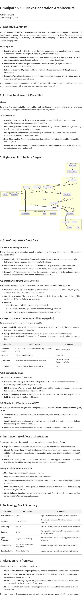

> **Note**: This is the documentation for Omnipath v3.0, a significant architectural upgrade. For the previous version, please refer to the `v2.0` branch.

# Omnipath v3.0: Next-Generation Multi-Agent Platform

**Omnipath v3.0** is a production-ready, event-driven multi-agent platform designed for building scalable, observable, and intelligent autonomous systems. It combines a unique emotional intelligence core with enterprise-grade governance, making it the ideal foundation for complex AI automation.

This version represents a complete architectural overhaul, moving from a synchronous request-response model to a fully asynchronous, event-driven system. It introduces industry-standard protocols and best-in-class observability tools to provide unprecedented control and insight into agent behavior.



---

## ✨ Key Features in v3.0

-   **🚀 Event-Driven Architecture**: Powered by **NATS.io**, the new core enables massive scalability and resilience. Agents communicate asynchronously, eliminating bottlenecks and allowing for independent scaling.

-   **💾 Event Sourcing & CQRS**: Agent state is now an immutable log of events, providing a perfect audit trail and enabling time-travel debugging. CQRS separates read and write concerns for optimal performance.

-   **🔭 Deep Observability**: With **OpenTelemetry**, **Langfuse**, and **Prometheus** integrated, every agent action, LLM call, and system metric is traceable and measurable from a unified dashboard in **Grafana**.

-   **🛡️ Reliable Workflows with Sagas**: Complex, multi-agent missions are orchestrated using the **Saga pattern**, ensuring that workflows either complete successfully or are safely compensated, maintaining data consistency across services.

-   **🧩 Standardized Protocols**: Adopts **Model Context Protocol (MCP)** for tool integration, creating a plug-and-play ecosystem for external services and APIs.

-   **🧠 Emotional Intelligence Core**: Retains its unique ability to factor emotion and risk into agent decision-making, providing a nuanced layer of control not found in other platforms.

-   **🔒 Enterprise-Grade Governance**: Built-in RBAC, multi-tenancy, and immutable audit logs provide the security and compliance features required for enterprise deployment.

---

## 🛠️ Technology Stack

| Category          | Technology                                        | Purpose                                    |
| ----------------- | ------------------------------------------------- | ------------------------------------------ |
| **Web Framework**   | FastAPI                                           | High-performance async API                 |
| **Database**        | PostgreSQL 15+                                    | Primary data store, event store            |
| **Messaging**       | NATS.io                                           | Event bus for inter-agent communication    |
| **Caching**         | Redis                                             | Session data, read model snapshots         |
| **Observability**   | OpenTelemetry, Langfuse, Prometheus, Jaeger       | Tracing, metrics, and LLM observability    |
| **Containerization**| Docker, Kubernetes                                | Scalable and resilient deployment          |
| **Agent Framework** | LangGraph (evaluated)                             | Visual, debuggable agent state machines    |

---

## 🚀 Quick Start

This project uses Docker Compose to set up a complete local development environment, including all necessary services.

### Prerequisites

-   Docker and Docker Compose
-   Git

### 1. Clone the Repository

```bash
git clone <your-repo-url>
cd omnipath-v3
```

### 2. Configure Environment

Copy the example environment file and update it with your credentials, especially for Langfuse and LLM providers.

```bash
cp .env.v3.example .env
```

**Edit `.env`** and add your API keys:

```env
# Langfuse (LLM Observability)
LANGFUSE_PUBLIC_KEY=pk-lf-...
LANGFUSE_SECRET_KEY=sk-lf-...

# LLM Providers
OPENAI_API_KEY=sk-...
ANTHROPIC_API_KEY=sk-...
```

### 3. Launch the Stack

Build and run all services using Docker Compose.

```bash
docker-compose -f docker-compose.v3.yml up --build -d
```

This will start:
-   `omnipath-backend` on port `8000`
-   `postgres` on port `5432`
-   `redis` on port `6379`
-   `nats` on port `4222` (client) and `8222` (monitoring)
-   `jaeger` on port `16686` (UI)
-   `prometheus` on port `9090`
-   `grafana` on port `3000`

### 4. Access Services

-   **API Docs**: [http://localhost:8000/docs](http://localhost:8000/docs)
-   **Grafana**: [http://localhost:3000](http://localhost:3000) (user: `admin`, pass: `admin`)
-   **Jaeger Tracing**: [http://localhost:16686](http://localhost:16686)
-   **NATS Monitoring**: [http://localhost:8222](http://localhost:8222)
-   **Prometheus**: [http://localhost:9090](http://localhost:9090)

### 5. Run Database Migrations

Once the backend is running, apply the initial database schema.

```bash
docker-compose -f docker-compose.v3.yml exec backend alembic upgrade head
```

---

## 🏛️ Project Structure

```
/omnipath-v3
├── backend/
│   ├── api/            # FastAPI routes
│   ├── agents/         # Agent implementations (Commander, Guardian, etc.)
│   ├── core/
│   │   ├── event_bus/  # NATS implementation
│   │   └── event_sourcing/ # Event store logic
│   ├── integrations/   # 3rd-party services (Observability, MCP)
│   ├── models/         # SQLAlchemy data models
│   ├── orchestration/  # Saga orchestrator
│   ├── services/       # Business logic (Auth, RBAC)
│   ├── main.py         # Application entry point
│   └── config/         # Settings and configuration
├── docs/
│   ├── ARCHITECTURE.md # Detailed architecture document
│   └── UPGRADE_GUIDE.md  # v2 to v3 upgrade guide
├── monitoring/
│   ├── prometheus.yml  # Prometheus scrape configs
│   └── grafana-datasources.yml # Grafana datasource provisioning
├── .env.v3.example     # Example environment file
├── docker-compose.v3.yml # Docker Compose for v3 stack
├── Dockerfile          # Application Docker image
└── README.md           # This file
```

---

## 📄 Documentation

-   **[Architecture Deep Dive](docs/ARCHITECTURE.md)**: A detailed explanation of the v3.0 architecture, components, and design patterns.
-   **[v2.0 to v3.0 Upgrade Guide](docs/UPGRADE_GUIDE.md)**: A guide for understanding the key changes and migration path from the previous version.

---

## 🤝 Contributing

Contributions are welcome! Please open an issue or submit a pull request.

## ⚖️ License

This project is proprietary and confidential. Unauthorized use, copying, or distribution is strictly prohibited.
