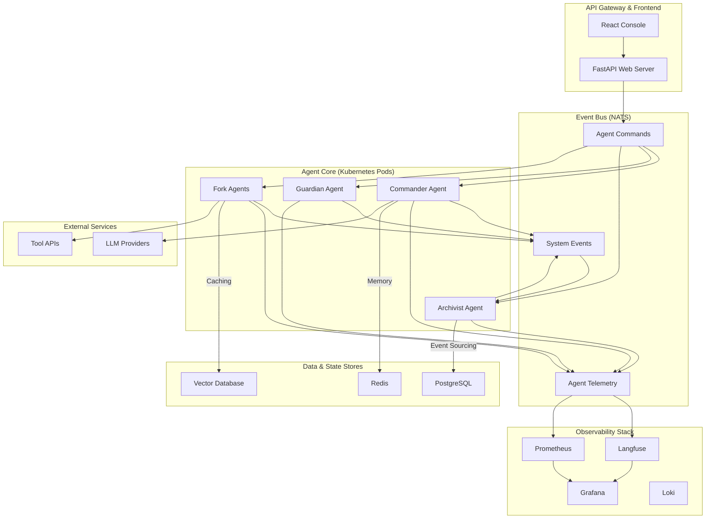

# Omnipath v3.0: Next-Generation Architecture

**Author:** Manus AI  
**Date:** January 28, 2026

---

## 1. Executive Summary

This document outlines the next-generation architecture for **Omnipath v3.0**, a significant upgrade that transforms the platform into a cutting-edge, event-driven multi-agent system. The new architecture prioritizes **scalability, observability, and extensibility** by adopting industry-standard protocols and modern design patterns.

### Key Upgrades

- **Event-Driven Core**: Transition from a synchronous, request-response model to an asynchronous, event-driven architecture using **NATS** for inter-agent communication.
- **Stateful Agents with Event Sourcing**: Agent state is now managed as an immutable sequence of events, providing a complete audit trail and enabling time-travel debugging.
- **Standardized Protocols**: Integration of **Model Context Protocol (MCP)** for tool use and **OpenTelemetry** for distributed tracing.
- **Enhanced Observability**: Deep, end-to-end visibility into agent behavior with **Langfuse** and Prometheus.
- **Decoupled Workflows**: Complex multi-agent workflows are orchestrated using the **Saga pattern**, ensuring reliability and fault tolerance.

This evolution positions Omnipath as a leader in the enterprise AI agent space, combining its unique emotional intelligence with a robust, scalable, and observable foundation.

---

## 2. Architectural Vision & Principles

### Vision

To create the most **reliable, observable, and intelligent** multi-agent platform for enterprise automation, where agents collaborate seamlessly and securely at scale.

### Core Principles

1.  **Asynchronous & Event-Driven**: All agent interactions are non-blocking and communicated via events. This enables massive scalability and resilience.
2.  **Immutability & Auditability**: Agent state is an immutable log of events (event sourcing), providing a perfect audit trail and simplifying debugging.
3.  **Interoperability & Standards**: Adherence to open standards (MCP, OpenTelemetry) prevents vendor lock-in and fosters a rich ecosystem.
4.  **Deep Observability**: Every agent action, decision, and communication is traceable, measurable, and analyzable.
5.  **Decentralized & Autonomous**: Empowering agents to collaborate peer-to-peer while maintaining centralized governance and control.

---

## 3. High-Level Architecture Diagram

---

## 4. Core Components Deep Dive

### 4.1. Event-Driven Agent Core

The synchronous agent execution model is replaced by a fully asynchronous, event-driven system powered by **NATS**. 

-   **Agent Services**: Each agent type (Commander, Guardian, etc.) runs as a separate, auto-scaling Kubernetes service that subscribes to specific NATS subjects.
-   **Commands & Events**: The API server emits **commands** (e.g., `mission.execute.commander`). Agents process these commands and emit **events** (e.g., `mission.approved.guardian`).
-   **Decoupling**: This decouples the API from the agent core, allowing agents to be updated, scaled, or restarted independently without affecting the main application.

### 4.2. Stateful Agents with Event Sourcing

Agent state is no longer a mutable record in a database. Instead, we adopt **Event Sourcing**.

-   **Immutable Event Log**: The state of an agent is stored as a sequence of events in PostgreSQL (e.g., `AgentCreated`, `MissionStarted`, `EmotionChanged`).
-   **State Reconstruction**: The current state of an agent is derived by replaying its event history. This can be snapshotted in Redis for performance.
-   **Benefits**:
    -   **Perfect Audit Trail**: Every state change is captured.
    -   **Time-Travel Debugging**: Reconstruct agent state at any point in time.
    -   **Temporal Queries**: Analyze how agent behavior changes over time.

### 4.3. CQRS (Command Query Responsibility Segregation)

To complement Event Sourcing, we implement CQRS.

-   **Command Side**: Handles all state mutations (writes). These are processed by the agent services and result in new events being stored.
-   **Query Side**: Handles all data retrieval (reads). A separate service creates and maintains denormalized "read models" optimized for fast queries. This prevents complex joins on the event log.

| Component | Responsibility | Technology |
|---|---|---|
| **Command Model** | Process commands, validate business logic, produce events | Agent Services, NATS |
| **Event Store** | Persist immutable events | PostgreSQL |
| **Query Model** | Create and update denormalized read views | Dedicated Service, PostgreSQL/Redis |
| **API Endpoints** | Serve read requests from query models | FastAPI |

### 4.4. Observability Stack

Observability is a first-class citizen in v3.0.

-   **Distributed Tracing**: **OpenTelemetry** is integrated into the core of every agent and service. All NATS messages and API calls carry trace context.
-   **LLM Tracing**: **Langfuse** is the central hub for LLM observability. It captures every prompt, response, tool call, and cost associated with agent execution.
-   **Metrics & Logging**: **Prometheus** scrapes metrics from all services, and structured logs are sent to **Loki**. **Grafana** provides unified dashboards.

### 4.5. Standardized Tool Integration (MCP)

To eliminate custom tool integrations, Omnipath v3.0 will feature a **Model Context Protocol (MCP) Server**.

-   **Tool Abstraction**: All external tools (APIs, databases, etc.) are exposed via a standardized MCP interface.
-   **Agent Integration**: Agents interact with tools using a generic MCP client, without needing to know the underlying implementation details.
-   **Benefits**: Radically simplifies adding new tools and promotes a plug-and-play ecosystem.

---

## 5. Multi-Agent Workflow Orchestration

Complex missions involving multiple agents are orchestrated using the **Saga Pattern**.

-   **Saga Orchestrator**: A dedicated service that manages the sequence of a multi-step mission.
-   **Steps & Compensations**: For each step in the workflow (e.g., `Commander approves -> Guardian validates`), the orchestrator defines a **compensating action** (e.g., `Guardian rejects -> notify user`).
-   **Reliability**: If any step fails, the saga orchestrator automatically triggers the compensating actions to roll back the workflow, ensuring data consistency and predictable outcomes.

### Example: Mission Execution Saga

1.  **Start Saga**: `mission.execute` command received.
2.  **Step 1**: Orchestrator sends `commander.evaluate` command.
3.  **Step 2**: Commander emits `commander.evaluated` event. Orchestrator sends `guardian.validate` command.
4.  **Step 3 (Success)**: Guardian emits `guardian.approved` event. Orchestrator sends `archivist.log` command. Saga completes.
5.  **Step 3 (Failure)**: Guardian emits `guardian.rejected` event. Orchestrator triggers compensation: sends `mission.fail` command. Saga ends.

---

## 6. Technology Stack Summary

| Category | Technology | Rationale |
|---|---|---|
| **Web Framework** | FastAPI | High-performance, async-native, mature ecosystem. |
| **Database** | PostgreSQL 15+ | Robust, reliable, excellent for structured data and event sourcing. |
| **Messaging** | NATS.io | Ultra-low latency, simple, built for cloud-native systems. |
| **Caching** | Redis | High-speed in-memory store for session data and read model snapshots. |
| **Agent Framework** | LangGraph (evaluated) | Provides a robust, visual, and debuggable state machine for agents. |
| **Observability** | OpenTelemetry, Langfuse, Prometheus | Best-in-class, open-standard stack for deep visibility. |
| **Containerization** | Docker, Kubernetes | Industry standard for scalable, resilient deployments. |

---

## 7. Migration Path from v2.0

Migrating from v2.0 to v3.0 will be a phased process.

1.  **Phase 1: Infrastructure Setup**: Deploy NATS, Langfuse, and the basic Kubernetes infrastructure.
2.  **Phase 2: Event-Driven Backbone**: Introduce the event bus and begin migrating simple agent interactions to be asynchronous.
3.  **Phase 3: Event Sourcing**: Migrate the agent state persistence from direct DB writes to an event-sourced model. This is the most significant change.
4.  **Phase 4: Full Migration**: Refactor remaining synchronous code and fully decommission the old architecture.

This phased approach minimizes risk and allows for incremental testing and validation at each stage.
