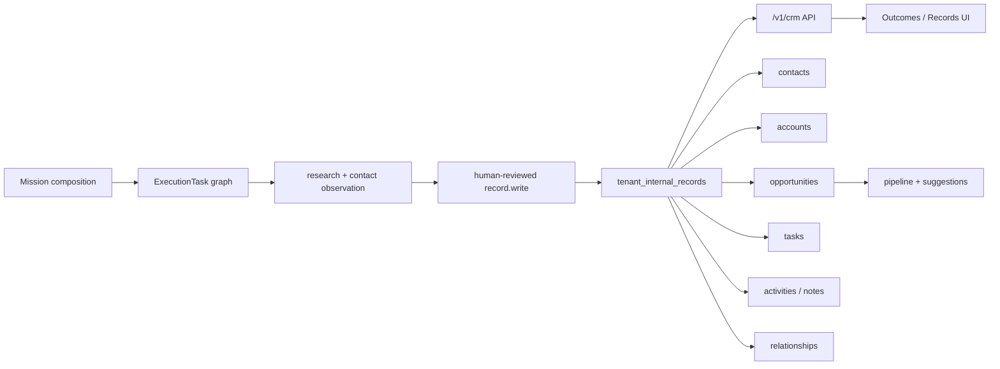
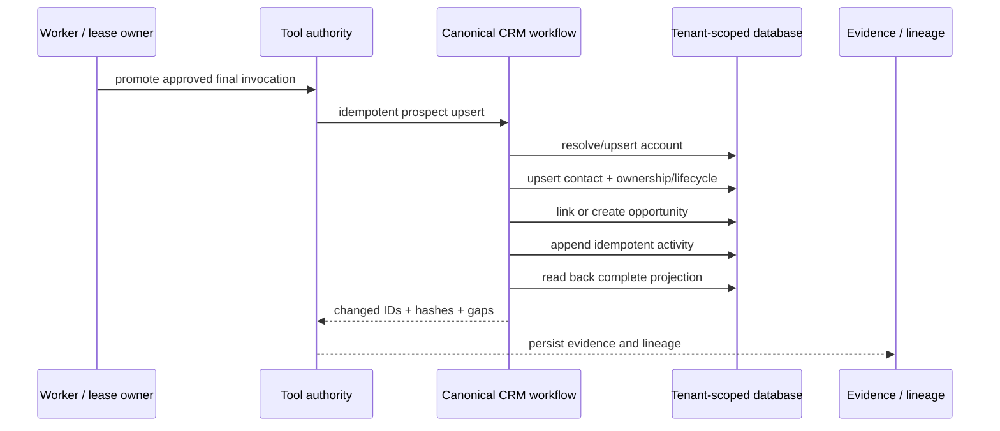

# Internal CRM Completion Map

**Status:** code-aligned implementation map  
**Updated:** 2026-09-03  
**Authority:** implementation, migrations, tests, and runtime proof; this document is not execution evidence

## Current system

The durable store and light-CRM service already support tenant-scoped accounts, contacts, opportunities, activities, tasks, relationships, search, pipeline stages, duplicate suggestions, ownership, tags, custom fields, and lifecycle stages. The API exposes reads, upserts, relationships, pipeline summaries, and workflow suggestions. The frontend exposes searchable lists, pipeline filtering, relationships, and timelines.

## Completion gaps

| Priority | Gap | Existing evidence | Completion condition |
|---|---|---|---|
| P0 | Mission execution and outcome quality were collapsed into one status | A 3-record, fully verified write was marked failed when contact coverage was 2/3 | Mission is `completed`; durable acceptance is `partially_met` with exact reasons |
| P0 | Mission `record.write` persists raw contacts outside the canonical light-CRM workflow | Runtime proof created contact rows, while workflow-owned account/opportunity/timeline hooks are separate | Mission ingestion uses one idempotent canonical workflow and proves contact, account, opportunity, activity, and readback results |
| P1 | Record UI is primarily read-only and exposes raw JSON for detail | `RecordsPage` has search/detail but no user-facing editor | Authorized create/edit, stage change, assignment, tags, notes, and follow-up controls are usable and tested |
| P1 | Pagination/count semantics are incomplete | API `total` is only the returned page length; repository limit is 50 | Cursor/page contract and true tenant-scoped totals exist |
| P1 | Duplicate handling only proposes candidates | Read-only duplicate endpoint | Reviewed merge preserves lineage, relationships, and rollback evidence |
| P2 | CRM schema is JSONB-only | One universal table plus schema helpers | Indexed fields and migration strategy are defined from measured query needs, without losing extensibility |

## Target write path

## Invariants

- Every read and mutation is tenant-scoped.
- Mission-originated writes require the queue, lease, policy, review, and payload-bound authorization path.
- A retry cannot duplicate contacts, opportunities, relationships, or activities.
- CRM completion is proven by readback; task completion alone is insufficient.
- Missing enrichment remains an explicit evidence gap and never becomes invented contact data.
- Runtime execution status and deliverable acceptance remain separately observable.
