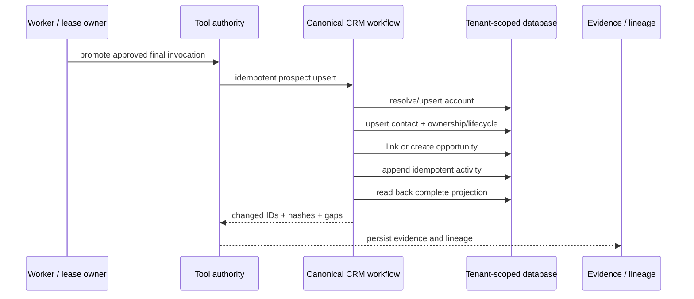
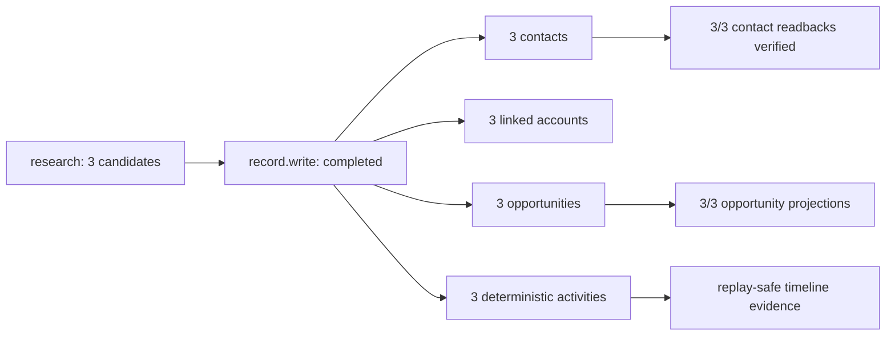

# Internal CRM Completion Map

**Status:** code-aligned implementation map  
**Updated:** 2026-09-03  
**Authority:** implementation, migrations, tests, and runtime proof; this document is not execution evidence

## Current system

```mermaid
flowchart LR
    M["Mission composition"] --> G["ExecutionTask graph"]
    G --> R["research + contact observation"]
    R --> A["human-reviewed record.write"]
    A --> S["tenant_internal_records"]
    S --> API["/v1/crm API"]
    API --> UI["Outcomes / Records UI"]

    S --> C["contacts"]
    S --> AC["accounts"]
    S --> O["opportunities"]
    S --> T["tasks"]
    S --> ACT["activities / notes"]
    S --> REL["relationships"]
    O --> P["pipeline + suggestions"]
```

The durable store and light-CRM service already support tenant-scoped accounts, contacts, opportunities, activities, tasks, relationships, search, pipeline stages, duplicate suggestions, ownership, tags, custom fields, and lifecycle stages. The API exposes reads, upserts, relationships, pipeline summaries, and workflow suggestions. The frontend exposes searchable lists, pipeline filtering, relationships, and timelines.

## Completion gaps

| Priority | Gap | Existing evidence | Completion condition |
|---|---|---|---|
| P0 | Mission execution and outcome quality were collapsed into one status | A 3-record, fully verified write was marked failed when contact coverage was 2/3 | Mission is `completed`; durable acceptance is `partially_met` with exact reasons |
| P0 | Mission `record.write` persisted raw contacts outside the canonical light-CRM workflow | Earlier runtime proof created contact rows with empty `account_id` and no mission-linked activities | **Resolved:** mission ingestion now uses one idempotent canonical workflow and runtime proof shows 3 contacts, 3 linked accounts, 3 opportunities, 3 deterministic activities, and readback |
| P1 | Record UI was primarily read-only and exposed raw JSON for detail | `RecordsPage` now has an authorized editor plus note and follow-up controls while retaining the canonical detail projection | **Resolved for the core operator path:** authenticated users can edit name/company, contact email, opportunity stage, owner, and tags, log notes, and create related follow-up tasks through the tenant-scoped CRM upsert route; the API/workflow remains the normalization and tenant-isolation authority. Reviewed duplicate merge remains follow-up work |
| P1 | Pagination/count semantics were incomplete | API now accepts bounded `offset` plus `limit`, and `total` is computed from the tenant-scoped filtered query rather than page length | **Resolved:** list API and Records UI expose page navigation with true tenant-scoped totals |
| P1 | Duplicate handling only proposes candidates | Read-only duplicate endpoint | Reviewed merge preserves lineage, relationships, and rollback evidence |
| P2 | CRM schema is JSONB-only | One universal table plus schema helpers | Indexed fields and migration strategy are defined from measured query needs, without losing extensibility |

## Target write path

## Invariants

- Every read and mutation is tenant-scoped.
- Mission-originated writes require the queue, lease, policy, review, and payload-bound authorization path.
- A retry cannot duplicate contacts, opportunities, relationships, or activities.
- CRM completion is proven by readback; task completion alone is insufficient.
- Missing enrichment remains an explicit evidence gap and never becomes invented contact data.
- Runtime execution status and deliverable acceptance remain separately observable.

## P0 runtime proof

Mission `7c011cb8-53e6-4eea-8e90-78d6cedd9730` produced the following durable topology after human approval:

The mission completed execution while recording `acceptance.status=partially_met` for the separately measured contact-evidence gap (`2` observed contacts of `3` prospects).
