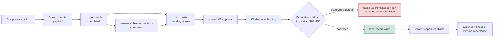
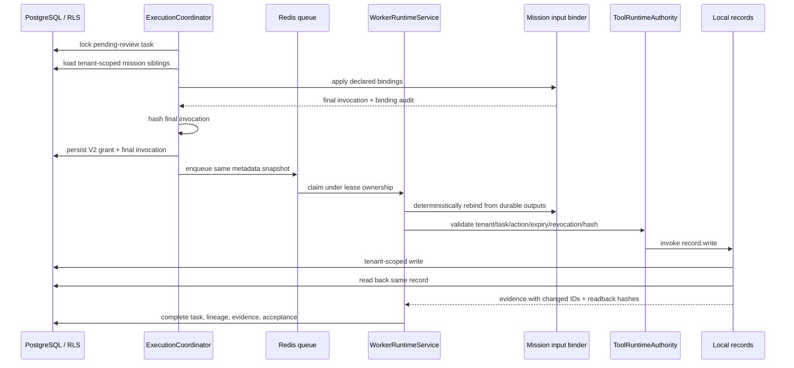
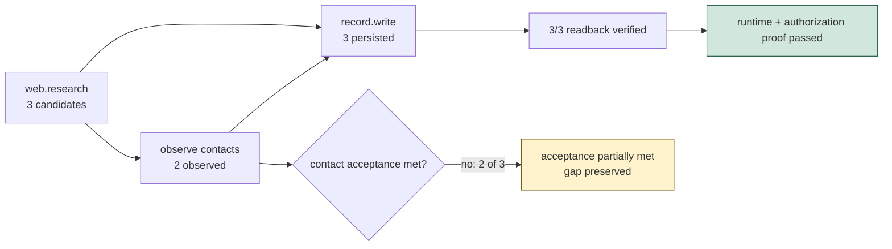

# Mission Runtime Authorization and Binding Analysis

**Status:** code-aligned runtime gap analysis  
**Observed:** 2026-09-03  
**Failure-reproduction mission:** `ea56ec1e-0c32-4e07-949f-c62201b9c9ad`  
**Corrected-path proof mission:** `6f08d216-4542-4c09-bcb2-3aeed24f3744`  
**Scope:** composition graph, dependency binding, human review, V2 side-effect authorization, queue, worker, evidence, and acceptance

This artifact maps the runtime path exposed by the internal CRM mission test. Implementation, persisted task state, and runtime output are the evidence sources; the diagram is an analysis of those sources, not independent proof.

## Observed mission graph

The graph correctly expressed two bindings into `record.write`:

| Producer | Output | Consumer input |
|---|---|---|
| `ability-web-research` | `$.prospect_candidates` | `$.input.context.prospect_candidates` |
| `ability-research-observe_contacts` | `$.observed_contacts` | `$.input.context.observed_contacts` |

## Root cause

`ExecutionCoordinator.approve_review_and_queue` issued the V2 grant against the composition seed. The seed intentionally contained empty lists because upstream results did not exist at compile time. `ToolRuntimeAuthority.execute` later rebound durable upstream outputs into the invocation before promotion. The security validator correctly rejected the now-different payload because its SHA-256 did not match the approved seed.

The defect was ordering and ownership, not overly strict validation. Removing the invocation hash check would allow an approval to authorize data the reviewer never approved.

## Responsibility and invariants

| Layer | Responsibility | Invariant |
|---|---|---|
| Compiler | Declare dependencies and input bindings | No runtime authority is implied by a graph |
| Coordinator | Review, finalize approval payload, issue grant, enqueue | Grant binds tenant, task, action, final invocation, expiry, and reviewer |
| Queue/worker | Preserve tenant and lease authority | Only a lease owner may start and execute queued work |
| Binder | Resolve declared values from completed sibling outputs | Missing/stale dependencies fail closed; no invented values |
| Runtime authority | Validate capability/adapter and side-effect grant | A payload mismatch never executes |
| Action/evidence | Perform the authorized write and prove it | Tenant-scoped readback matches the written record |
| Acceptance | Evaluate durable outputs | Mission completion is not inferred from task status alone |

## Gap analysis

| Gap | Runtime evidence | Resolution | Proof |
|---|---|---|---|
| Approval hashed an unbound seed | `HANDLER_FAILED`: side-effect authorization missing after hash mismatch | Bind completed dependency outputs at the coordinator before grant issuance | Coordinator regression test compares grant hash to bound invocation |
| Early review could approve unknown dependency values | Side-effect task enters review alongside queued producers | Reject approval until every declared dependency is complete | Regression test keeps task in `pending_review` and does not enqueue |
| Failure logs did not expose structured reason at console level | Worker log emitted only `task_dispatch_handler_failed` | Existing durable `metadata_json.failure` remains the authoritative diagnostic surface | Runtime task readback/query |
| Mission did not write CRM records after approval | Failed task; zero new internal CRM records | Correct ordering preserves strict promotion and enables authorized execution | Repeated Compose runtime mission and readback count |
| Research breadth did not satisfy contact acceptance | Corrected run found 3 prospects but only 2 observable contacts; the old rollup collapsed this into total mission failure | Separate execution state from outcome acceptance: successful tasks complete the mission while metadata/audit records `partially_met` | Rollup tests plus repeated Compose runtime proof |

## Corrected-path runtime result

The repeated mission completed the complete authorized execution path:

- `web.research`: `completed`, with 3 prospect candidates.
- `research.observe_contacts`: `completed`, with 2 public contacts from the 3 candidates.
- `record.write`: approved only after both dependencies completed, then `completed`.
- Binding audit: 3 candidates and 2 observed contacts were bound into the reviewed invocation.
- CRM result: 3 tenant-scoped records persisted; all 3 were read back and content-hash verified.
- Evidence: the action result identifies the `TaskDispatcher -> tool.invoke -> ActionRegistry` runtime path and all three changed/inspected record IDs.
- Original mission result: `failed` under the old rollup because the contact-observation threshold was not met. The corrected rollup reports successful execution as `completed` and persists the evidence gap independently as `acceptance.status=partially_met`.

## Proof plan

1. Run focused coordinator, binding, dispatcher, sales action, and mission acceptance tests.
2. Run contract drift, runtime authority inventory, and ability rollout checks.
3. Rebuild and restart API/worker images without deleting volumes.
4. Submit a new mission through compose, confirm, compile, runtime admission, task materialization, and queue admission.
5. Wait for both producer tasks to complete, approve `record.write`, and verify:
   - all three tasks complete;
   - approval hash equals the persisted final invocation hash;
   - internal CRM records exist only for the mission tenant;
   - every persisted record has readback evidence;
   - mission acceptance is evaluated independently and its result agrees with the durable outputs.
