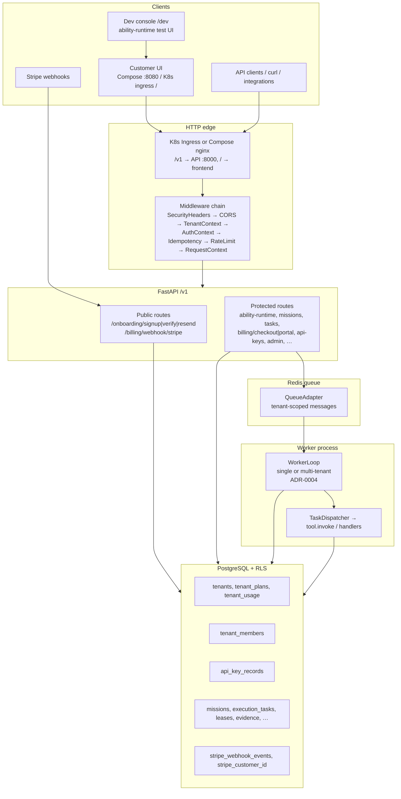
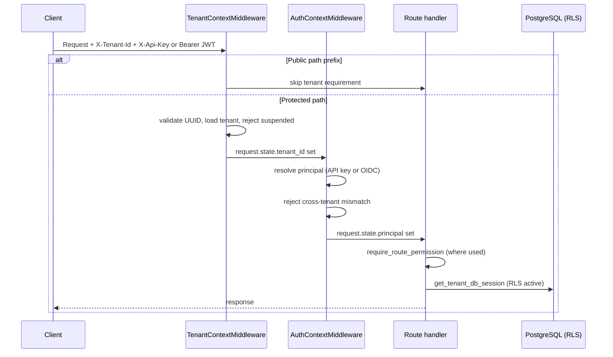
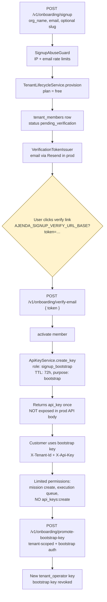
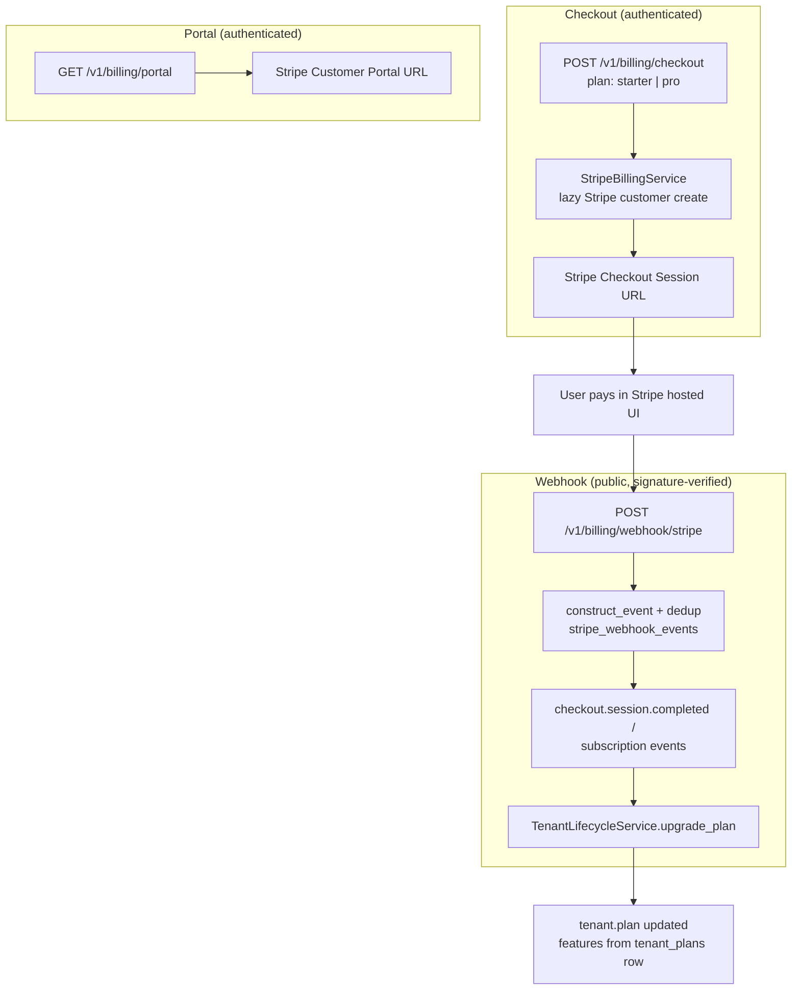
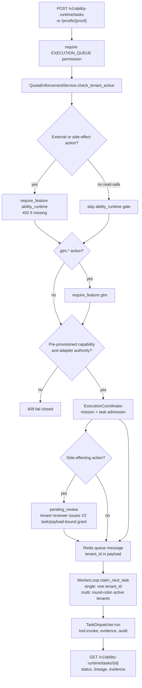
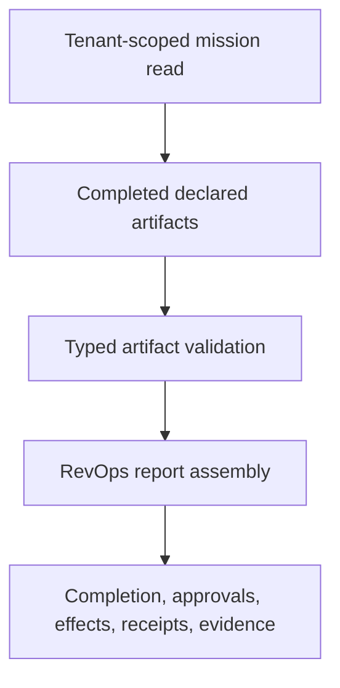
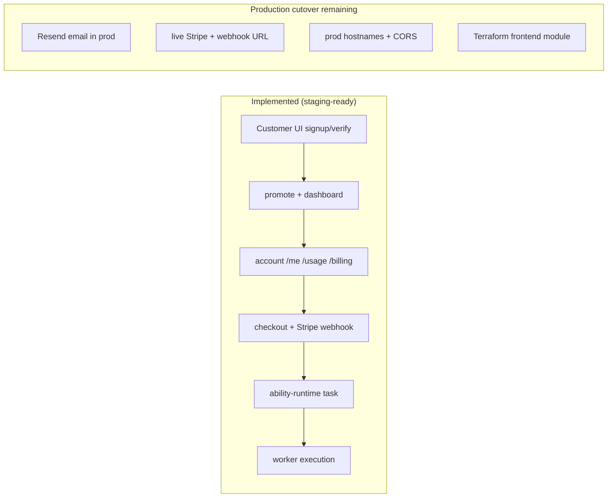
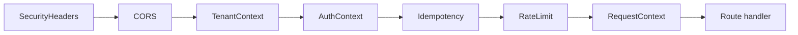
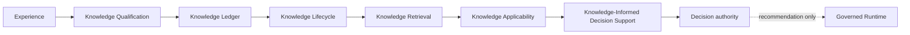

# Ajenda AI — System Architecture (Code-Aligned)

**Status:** Active  
**Last verified against the 2026-08-18 V1 Path 3 working tree based on `d8a786c383d79f985663ebc1c0428d819f2d6b4a`:** 2026-08-18
**Source of truth:** implementation files, migrations, tests — not aspirational product docs.

This document is the canonical visual and narrative map of what exists in the repository today. When docs conflict with code, code wins.

---

## 1. High-level system map

---

## 2. HTTP request path (protected route)

**Public path prefixes (no auth, no tenant header):**

- `/health`, `/readiness`, `/metrics`, `/v1/observability/metrics`
- `/v1/admin/*` (admin auth handled in routes)
- `/v1/billing/webhook/*`
- `/v1/onboarding/signup`, `/verify-email`, `/resend-verification`
- `/docs`, `/openapi.json`, `/redoc`

---

## 3. Self-serve onboarding flow (API + customer frontend)

**Frontend:** `/signup` and `/verify-email` pages call the onboarding APIs. Staging may set `AJENDA_SIGNUP_EXPOSE_VERIFICATION_TOKEN=true` for scripted proof; production forbids token in API responses and requires Resend + real verify URL (`AJENDA_SIGNUP_VERIFY_URL_BASE`).

---

## 4. Billing and plan upgrade flow (implemented — API only)

**Plan ↔ feature reality (migrations `0006`, `0026`):**

| Plan | `ability_runtime` | `gtm` | Notes |
|------|-------------------|-------|-------|
| free | no | no | Default signup plan |
| starter | no | no | webhooks only |
| pro | yes | yes | Required for most side-effect ability paths |
| enterprise | yes | yes | unlimited quotas |

**Product alignment:** Customer `/billing` sells **Pro only** (unlocks `ability_runtime`). Starter remains a webhook-only admin/sales tier; self-serve checkout must not target starter.

**RBAC:** Checkout and portal require `billing:manage`. Account billing status is read-only via `GET /v1/account/billing` (`account:read`); bootstrap keys are blocked until promote.

---

## 5. Paid work execution path (ability runtime)

**Worker tenancy:** `AJENDA_WORKER_TENANT_MODE=multi` (default in staging/prod templates) round-robins active tenants via `tenant_scheduler`. `single` mode polls one `AJENDA_WORKER_TENANT_ID` only.

**Single execution spine:** the former POST worker claim/start/run mission-bridge routes now return
HTTP 410 after permission validation. Their compatibility services are fail-closed tombstones.
Only `WorkerLoop`/`WorkerRuntimeService` may claim, start, and dispatch queued work; GET readbacks
remain available for historical metadata.

For graph-bound side effects, the coordinator resolves completed dependency outputs before issuing
the payload-bound V2 approval grant. The worker deterministically rebinds and validates the exact
invocation hash before execution. See
[Mission Runtime Authorization and Binding Analysis](MISSION_RUNTIME_AUTHORIZATION_BINDING_ANALYSIS.md).
The code-aligned CRM surface, target ingestion path, and remaining completion gaps are tracked in
[Internal CRM Completion Map](INTERNAL_CRM_COMPLETION_MAP.md).

### 5.1 RevOps mission deliverable read path

`GET /v1/missions/{mission_id}/deliverable` assembles a tenant-owned RevOps report without
mutating runtime state or granting execution authority. The route loads the mission, execution
tasks, draft documents, evidence, and outcome reviews through tenant-scoped repositories. The
assembler accepts only completed, declared artifacts, validates typed artifact contracts, and
recomputes deliverable completeness independently from task status.

The report keeps `task_state.all_succeeded` separate from
`completion.artifact_complete` and final `completion.complete`. Unresolved drafts, conflicting
identity fields, invalid artifacts, missing real-effect receipt identifiers, and persisted
request/projection drift remain visible or fail closed. A missing runtime deliverable state returns
HTTP 404; invalid or inconsistent state returns HTTP 409.

---

## 6. End-to-end paid customer loop (staging-ready)

**Proof surfaces:**

- Integration: `tests/integration/saas/test_paid_customer_loop_real.py`
- Compose HTTP: `deploy/scripts/paid-customer-loop-staging-proof.sh`
- Runbook: `ops/runbooks/paid-customer-loop-staging.md`

**Stranger completion:** full path on local/staging Compose (`:8080`). Production requires cutover checklist in runbook §5.

---

## 7. Middleware order

Onboarding routes use IP-keyed rate limits and body-hash idempotency when `AJENDA_SIGNUP_REQUIRE_IDEMPOTENCY_KEY` is true (default: true in production).

---

## 8. API route inventory (`/v1`)

| Prefix | Auth | Purpose |
|--------|------|---------|
| `/v1/auth/*` | mixed | OIDC exchange; `/me` returns principal |
| `/v1/onboarding/*` | public + tenant | Self-serve signup, verify, promote |
| `/v1/account/*` | tenant | Self-service me, plan, usage, billing status |
| `/v1/billing/*` | tenant / public webhook | Stripe checkout, portal, webhook |
| `/v1/ability-runtime/*` | tenant | Product-facing task launcher |
| `/v1/crm/*` | tenant | Light CRM over `tenant_internal_records` (pipeline, records, suggestions) |
| `/v1/review-queue/*` | tenant | Draft/artifact review approve/reject queue |
| `/v1/api-keys/*` | tenant | Key lifecycle |
| `/v1/missions/*`, `/v1/tasks/*` | tenant | Mission/task queue authority plus read-only assembled RevOps deliverable |
| `/v1/workforce/*`, `/v1/branches/*` | tenant | Fleet and branch management |
| `/v1/runtime/*`, `/v1/operations/*` | tenant | Governor and ops controls |
| `/v1/capabilities/*`, `/v1/capability-adapters/*` | tenant | Declaration contracts |
| `/v1/business-profile/*` | tenant | Durable tenant context |
| `/v1/evidence/*`, `/v1/outcome-reviews/*` | tenant | Governance records |
| `/v1/retrieval-contracts/*`, `/v1/mission-brief/*` | tenant | Read-model / future recall |
| `/v1/webhooks/*` | tenant | Outbound webhook management |
| `/v1/observability/*` | tenant / metrics | Lineage, metrics |
| `/v1/admin/*` | admin | Cross-tenant control plane |
| `/v1/system/*` | tenant | Status and diagnostics |

Root (unversioned): `/health`, `/readiness`

---

## 9. Database migrations (Alembic head)

**Head revision:** `0038_knowledge_retrieval`

| Rev | Description |
|-----|-------------|
| 0001–0005 | Runtime schema, API keys, RLS, recovery, compliance |
| 0006 | SaaS tenants, plans, usage |
| 0007–0010 | Webhooks, retry/review, free-plan alignment |
| 0011–0022 | Capabilities, evidence, outcomes, retrieval, mission plans, business profiles |
| 0023–0025 | Adapter side effects, provider credentials, stripe_customer_id |
| 0026 | Seed ability_runtime + gtm on pro/enterprise |
| 0027 | stripe_webhook_events dedup table |
| 0028 | tenant_members |
| 0029 | api_key bootstrap fields (purpose, expires_at, roles_json) |
| 0030 | signup_attempt_log + abuse tables |
| 0031 | backfill mission_plans from legacy mission metadata |
| 0032 | OIDC login intents + customer auth sessions |
| 0033 | tenant_internal_records (Ajenda standalone brain mode) |
| 0034 | email_send_idempotency_receipts (SMTP replay protection) |
| 0035 | mission_composition_proposals (including actor/status history fields) |
| 0036 | interpretation thread/proposal-kind fields and tenant/actor/thread index |
| 0037 | tenant-scoped durable Knowledge qualification and artifact ledger tables |
| 0038 | JSONB GIN index for Knowledge Retrieval candidate discovery |

---

## 10. Frontend (actual state)

| Item | Status |
|------|--------|
| Location | `frontend/src/` — pages, components, auth session, API client |
| Framework | React 19 + Vite + `react-router` 8.3.0 (client-only SPA) |
| Customer routes | `/signup`, `/verify-email`, `/promote`, `/dashboard`, `/billing`, `/tasks` |
| Dev route | `/dev` — Runtime Ability Console (ability-runtime + billing test buttons) |
| Auth model | sessionStorage session (bootstrap vs operational API keys + tenant id) |
| API integration | onboarding, account, billing, ability-runtime |
| Compose deploy | `:8080`, nginx proxies `/v1`, `/health`, `/readiness` to API |
| K8s deploy | `ajenda-frontend` + ingress `/` → frontend; image `ghcr.io/<org>/<repo>-frontend:<version>` |

---

## 11. Test and proof surfaces

| Area | Tests |
|------|-------|
| Onboarding | unit, contract (`test_onboarding_*`), integration (`test_tenant_onboarding_real.py`) |
| Stripe webhook | contract, integration (`test_stripe_webhook_real.py`) |
| SaaS lifecycle | integration (`test_tenant_lifecycle_real.py`) |
| Runtime / queue | extensive integration under `tests/integration/runtime/` |
| RevOps deliverable assembly | tenant-scoped API, typed assembly, completion independence, approval/effect/receipt failure paths |
| Paid customer E2E | `test_paid_customer_loop_real.py`, `paid-customer-loop-staging-proof.sh` |
| Live runtime proof (CI) | `.github/workflows/ci.yml` on `main` push → `deploy/scripts/live-runtime-proof.sh` |
| Brain / internal CRM | migration `0033`, `tenant_internal_records`, brain capstone proof script |

---

## 12. Deployment targets

| Target | Ships | Does not ship |
|--------|-------|---------------|
| `deploy/compose/docker-compose.prod.yml` | api, worker, **frontend**, migrate, db, redis, prometheus, otel, hubspot-crm-ingress (optional plugin TLS) | per-tenant dedicated worker pools |
| `deploy/k8s/*` | api, worker, **frontend**, ingress (`/v1` → API, `/` → frontend) | — |
| `infra/` (Terraform/AWS) | VPC, RDS, Redis, ECS patterns | customer frontend module |

---

## 13. Remaining product work (production cutover)

1. Production email — Resend + `AJENDA_SIGNUP_EXPOSE_VERIFICATION_TOKEN=false`
2. Live Stripe keys, price IDs, and webhook endpoint on production API URL
3. Production `AJENDA_SIGNUP_VERIFY_URL_BASE` and `AJENDA_CORS_ALLOWED_ORIGINS`
4. Plan/feature alignment (starter checkout vs `ability_runtime` on pro)
5. Terraform/AWS frontend hosting (if production edge is ECS/ALB-only today)
6. Run staging runbook + E2E proof against production-like hostnames before launch

---

## 14. Related docs

### Intelligence authority chain

- **Knowledge** is a learned, non-causal proposition.
- **Applicability** establishes whether that proposition applies to typed current context.
- **Decision Support** states what applicable knowledge supports, limits, or leaves unresolved about exactly identified options and criteria. Its evidence is derived provenance, never an independent world observation.
- **Decision** remains the sole owner of criterion weighting, scoring, and recommendation selection.
- **Runtime** executes only through the existing queue, dispatcher, and worker-lease authorities; neither Knowledge nor Decision Support grants execution authority.

The production composition is `Knowledge Ledger → Lifecycle → Retrieval → Applicability → Decision Support → decision.recommend_next_action`. It performs tenant-scoped reads, preserves the original Decision request's weights, forbids prose semantic inference, and creates no persistence table.

- `README.md` — repository entry point
- `PROJECT_SPEC.md` — canonical specification
- `docs/SAAS_ARCHITECTURE.md` — tenant/plan/quota enforcement detail
- `docs/deployment/production-env-contract.md` — required production variables
- `docs/contracts/authority-ledger.v1.yaml` — machine-readable authority map
