# G.R.A.F.T.1st — GTM, CRM, Receptionist, and Social Canonical Map

**Status:** proposed future-state architecture; not implementation evidence

**Design target:** `revops.gtm-crm-communications` `2.0.0`

**Current-state anchors:** [`SYSTEM_ARCHITECTURE.md`](../architecture/SYSTEM_ARCHITECTURE.md), [`dependency-graph.md`](../architecture/dependency-graph.md), [`mission-composition-function-graph.md`](../architecture/mission-composition-function-graph.md), [`VR01_REVENUE_OPERATIONS_BASELINE.md`](VR01_REVENUE_OPERATIONS_BASELINE.md)

**Method:** G.R.A.F.T.1st canonical design followed by G.R.A.F.T.+ observed-implementation reconciliation

## 1. Purpose and boundary

This document maps the completed vertical before substantial implementation. It extends Ajenda's existing mission-composition, governed-runtime, evidence, tenant, credential, and network-egress graphs. It does not create a second planner, queue, worker, policy authority, CRM truth store, or provider execution path.

The completed vertical accepts GTM and customer-relationship outcomes and coordinates research, identity resolution, qualification, CRM lifecycle work, email, calendar, receptionist/phone work, Facebook, Instagram, YouTube, reporting, attribution, and outcome learning.

Provider adapters translate canonical requests. They do not own Ajenda's business rules, consent rules, mission state, authorization, evidence, or customer identity.

## 2. Legend

| Mark | Meaning |
| --- | --- |
| `[CURRENT]` | Existing Ajenda architectural authority or verified capability family |
| `[EXTEND]` | Existing authority that needs a new contract or behavior |
| `[NEW]` | Proposed node with no implementation claim |
| `requires` | Hard dependency; consumer cannot proceed without it |
| `conditional` | Required only when the requested outcome activates it |
| `optional` | May improve the outcome but cannot silently become required |
| `authorizes` | Grants narrowly scoped permission; never inferred from connectivity |
| `produces` | Produces a typed artifact |
| `validates` | Independent check; does not replace the producing proof path |
| `reconciles` | Compares requested, persisted, provider, and observed state |

Canonical dependency direction follows the existing repository graph: **consumer → dependency**. Flow diagrams use execution direction for readability and label dependencies where ambiguity matters.

## 3. Placement on the existing Ajenda graph

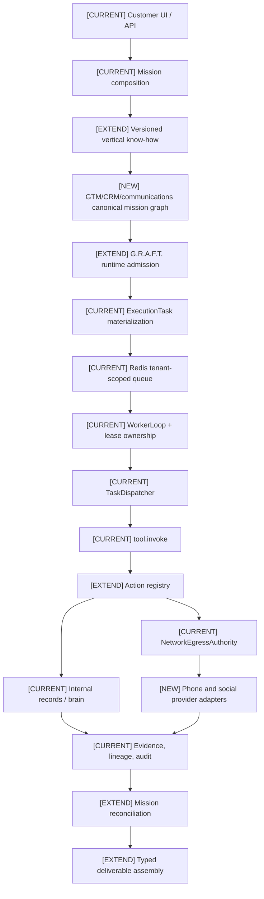

The vertical is intertwined with Ajenda through declarative planning and the existing runtime spine. It has no independent execution authority.

## 4. Completed outcome graph

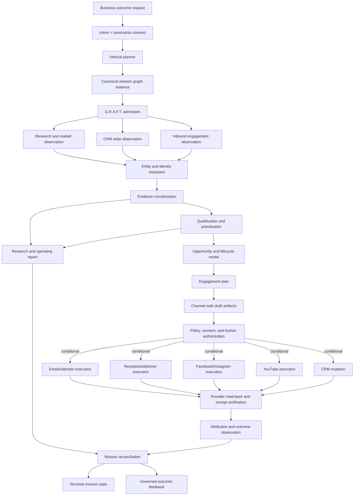

## 5. Domain subgraphs

### 5.1 Research, identity, and evidence

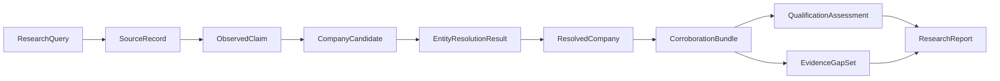

An article, directory entry, or search result is a source, not automatically a company. Qualification requires a resolved identity and claim-level evidence. Unsupported claims remain gaps rather than being filled by prose inference.

### 5.2 Canonical CRM lifecycle

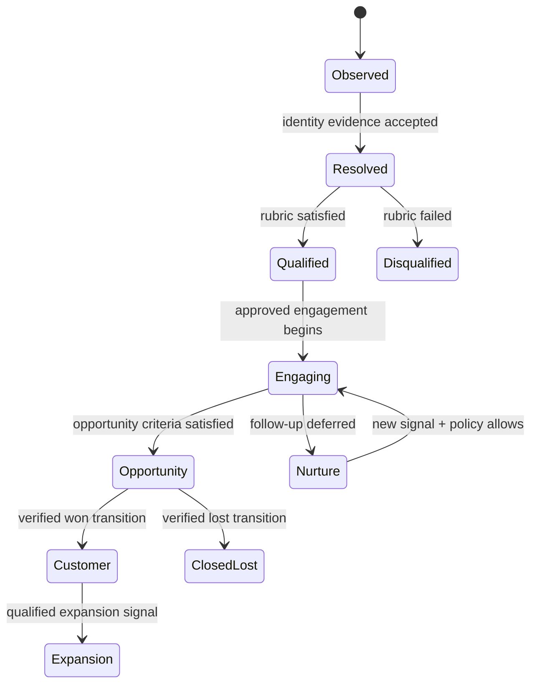

Provider stages map to these canonical states through a versioned mapping. A provider response cannot silently redefine the canonical lifecycle.

### 5.3 CRM reconciliation

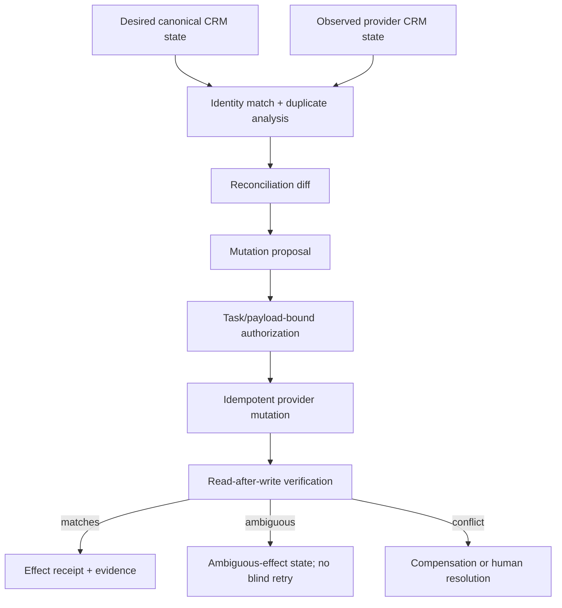

### 5.4 Inbound receptionist and phone

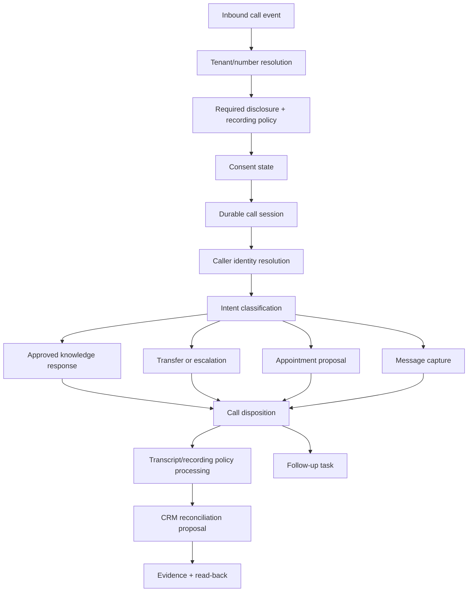

Outbound calling is a separate, higher-risk subgraph: suppression, consent, jurisdiction, local-time window, approved purpose, task/payload authorization, idempotent call initiation, disposition, and ambiguous-effect handling are all hard dependencies.

### 5.5 Social channel family

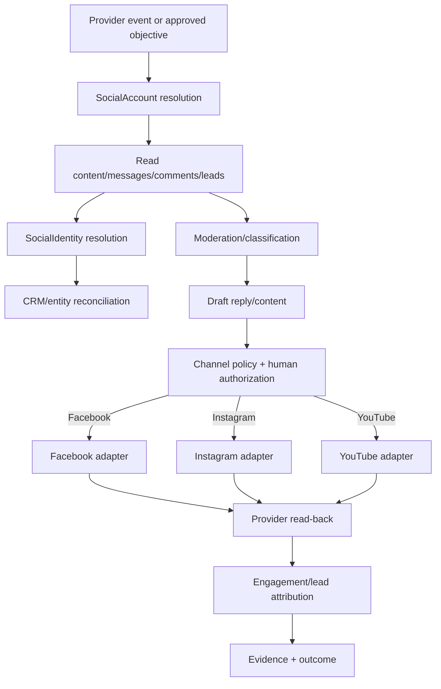

Read, moderate, draft, reply/message, upload, and publish are different actions with separate schemas and side-effect classes. Account connectivity grants none of the write authorities.

## 6. Ownership registry

| Concern | Canonical owner | Must not be owned by |
| --- | --- | --- |
| Requested outcome and limits | Mission request contract | Provider adapter |
| Vertical workflow and supported outcomes | Versioned vertical know-how | Action handler or UI |
| Executable graph selection | Mission compiler | Capability/adapter records |
| Runtime admissibility | G.R.A.F.T. admission + existing policy authorities | Planner prose |
| Task lifecycle and terminal transition | Worker runtime + mission reconciler | Provider callback |
| Queue delivery and lease ownership | Existing queue/WorkerLoop runtime | Vertical service |
| Tenant identity and RLS boundary | Existing tenant/auth/DB authorities | Connector credential |
| Action permission | Operating charter | Connected-account state |
| Side-effect permission | Independent review authorization | Composition or adapter |
| Secrets and refresh material | Credential service | Mission metadata or evidence |
| Network destination safety | NetworkEgressAuthority | Individual handlers |
| Canonical person/company/social identity | Identity-resolution domain | HubSpot, Meta, or telephony provider |
| Canonical CRM lifecycle | CRM domain service | Provider pipeline fields |
| Conversation/session state | Receptionist domain service | Telephony webhook alone |
| Consent/suppression state | Communication-policy domain | Dialer adapter |
| Claims, sources, receipts, and gaps | Evidence domain | Report prose |
| Provider translation | Provider adapter | Canonical domain service |
| Outcome attribution | Attribution domain | Provider vanity metrics |
| Deliverable completeness | Typed deliverable assembler | Task status alone |

## 7. Contract registry

Every contract requires a stable name, schema version, producer, consumers, tenant scope, validation rules, persistence owner, compatibility behavior, failure semantics, and evidence obligations.

| Family | Required contracts |
| --- | --- |
| Mission/design | `BusinessOutcomeRequest`, `ExecutionConstraints`, `VerticalKnowHowRef`, `CanonicalMissionGraph`, `GraphNodeContract`, `GraphEdgeContract`, `AcceptanceCriterion` |
| Runtime | `RuntimeAdmissionDecision`, `ExecutionTask`, `WorkerLease`, `ActionInvocation`, `ActionResult`, `RetryPolicy`, `IdempotencyContract`, `MissionReconciliationResult` |
| Research | `ResearchQuery`, `SourceRecord`, `ObservedClaim`, `CompanyCandidate`, `ResolvedCompany`, `CorroborationBundle`, `QualificationAssessment`, `EvidenceGapSet`, `ResearchReport` |
| Identity | `IdentityCandidate`, `IdentityEvidence`, `IdentityMatchDecision`, `MergeProposal`, `CanonicalEntityRef`, `ProviderIdentityRef` |
| CRM | `CRMAccount`, `CRMContact`, `CRMOpportunity`, `CRMActivity`, `CRMTask`, `CRMStageTransition`, `CRMReconciliationPlan`, `CRMMutationRequest`, `CRMMutationResult`, `CRMReadbackResult` |
| Phone | `PhoneNumberIdentity`, `CallEvent`, `CallSession`, `CallerIdentity`, `ConsentDecision`, `ReceptionistPolicy`, `ConversationTurn`, `TransferRequest`, `AppointmentProposal`, `CallDisposition`, `TranscriptArtifact`, `RecordingArtifact` |
| Social | `SocialAccount`, `SocialIdentity`, `SocialContent`, `SocialInteraction`, `SocialMessage`, `LeadCaptureEvent`, `ModerationDecision`, `ContentDraft`, `PublicationRequest`, `PublicationResult`, `EngagementSnapshot` |
| Governance | `OperatingCharter`, `CredentialRequirement`, `SideEffectAuthorization`, `SuppressionDecision`, `JurisdictionDecision`, `AuditEvent`, `EvidenceItem`, `LineageRelationship`, `EffectReceipt` |
| Learning | `OutcomeObservation`, `AttributionEvent`, `OutcomeReview`, `KnowledgeCandidate`, `ApplicabilityDecision`, `DecisionSupportResult` |

## 8. Dependency and authority matrix

| Consumer | Dependency | Kind | Failure behavior |
| --- | --- | --- | --- |
| All nodes | tenant context | requires | reject before read/write |
| Graph materialization | valid graph + admission decision | requires | no task creation |
| External read | credential when provider requires it | conditional | block or explicitly use declared public/internal alternative |
| Report synthesis | corroborated claims + evidence gaps | requires | produce incomplete report or fail by declared contract; never invent evidence |
| Qualification | resolved entity + approved rubric | requires | `INDETERMINATE` |
| CRM mutation | reconciliation plan | requires | no direct provider write |
| Any external mutation | operating-charter permission | requires | reject |
| Any send/publish/call/write | task/payload-bound authorization | authorizes | pending review/reject |
| Outbound phone | consent, suppression, jurisdiction, time window | requires | reject |
| Social publish | content approval + account/channel scope | requires | reject |
| Retriable mutation | idempotency/effect-ambiguity policy | requires | no blind retry |
| Completion | terminal tasks + artifact reconciliation | requires | remain running/failed with reason |
| Outcome learning | verified observation + provenance | requires | do not promote knowledge |

## 9. Persistence and state resources

The design expects explicit tenant-scoped stores for canonical entities, provider identity mappings, consent/suppression decisions, call sessions, channel events, reconciliation plans, mutation receipts, attribution events, and typed artifacts. Exact table design is deferred to a migration LAP, but ownership is not:

- Canonical identity state belongs to Ajenda, not an external CRM.
- Provider payloads are observations with retention and minimization rules.
- Credentials and refresh secrets never enter mission artifacts, transcripts, or evidence payloads.
- Call recordings and transcripts have separate retention/deletion policies.
- Effect claims require provider identifiers or an explicit ambiguous-effect state.
- All tenant-associated tables require the repository's full RLS envelope unless explicitly reviewed as control-plane state.

## 10. System invariants

1. All executable work enters through `ExecutionTask`, queue admission, `WorkerLoop`, lease ownership, `TaskDispatcher`, and `WorkerRuntimeService`.
2. Declarative capability, adapter, know-how, and graph records never execute work.
3. Tenant scope is verified before reads, writes, credential resolution, evidence persistence, and provider callbacks.
4. Connected credentials do not grant action or side-effect authority.
5. Search hits and social profiles are not canonical identities until resolved.
6. Provider CRM state cannot silently redefine Ajenda's canonical lifecycle.
7. External write/send/publish/call actions have explicit side-effect classes, review rules, idempotency analysis, and evidence outputs.
8. A retry cannot duplicate an external effect; ambiguous effects require reconciliation or human resolution.
9. Reports distinguish observation, inference, and evidence gap.
10. `SATISFIED`, `VIOLATED`, and `INDETERMINATE` remain separate adjudication results.
11. Task terminality, artifact completeness, and mission completion remain independent facts.
12. Independent proof paths are preserved: schema acceptance, typed behavioral consumption, runtime effect proof, and read-back verification cannot substitute for one another.

## 11. Temporary parallel work packages

These packages are intended for separate implementation windows. They are not permanent agent assignments. A window owns only its bounded files and contracts for the duration of the change.

| Package | Scope | May start when | Shared-contract rule | Merge dependency |
| --- | --- | --- | --- | --- |
| WP0 | Freeze schemas, IDs, ownership, edge types, fixtures | immediately | sole editor of initial contract registry | first |
| WP1 | Vertical know-how, intent/outcomes, composition graph | WP0 draft accepted | consumes runtime contracts; cannot change runtime authority | after WP0 |
| WP2 | Research, entity resolution, corroboration, report synthesis | research/identity contracts frozen | owns typed research artifacts | after WP0; parallel with WP1 |
| WP3 | Canonical CRM domain, lifecycle, reconciliation | CRM/identity contracts frozen | provider-neutral only | after WP0; parallel with WP1/WP2 |
| WP4 | Receptionist/phone domain and inbound runtime | phone, consent, session contracts frozen | no outbound activation | after WP0; parallel with WP2/WP3 |
| WP5 | Meta read-only adapters and event normalization | social/provider contracts frozen | Facebook/Instagram adapter boundary only | after WP0 |
| WP6 | YouTube read-only adapter and event normalization | social/provider contracts frozen | YouTube adapter boundary only | after WP0; parallel with WP5 |
| WP7 | Governance extensions: charters, credentials, consent, authorization, idempotency | WP0 + threat/failure review | preserves existing runtime spine | before mutation packages |
| WP8 | CRM/social/phone mutations and read-back | WP3-WP7 contracts and sandbox proofs | one action per effect class; disabled by default | late |
| WP9 | Cross-channel attribution, deliverables, mission reconciliation | typed outputs frozen | consumes artifacts without granting authority | after WP1-WP8 read paths |
| WP10 | Independent conformance and live mission suite | fixtures frozen | must not share implementation assumptions | continuous/final |

Every window handoff must state: bounded subgraph, files touched, contracts produced/consumed, invariants, tests, migration impact, and unresolved dependencies. Changes to a frozen shared contract require an explicit version proposal rather than an uncoordinated edit.

## 12. Implementation waves

1. **Foundation:** contract registry, graph schema, ownership, identity, evidence, vertical outcome vocabulary, and visible readiness blockers.
2. **Read-only intelligence:** research, CRM reads, inbound phone event normalization, and social/YouTube observation.
3. **Internal decisions:** qualification, reconciliation proposals, reports, drafts, moderation suggestions, and follow-up recommendations.
4. **Inbound assistance:** receptionist responses, transfers, appointment proposals, and CRM activity proposals under consent policy.
5. **Controlled effects:** CRM writes, email/calendar effects, social replies/publishing, and outbound calls—each independently gated and sandbox-proven.
6. **Cross-channel optimization:** attribution, outcome review, knowledge qualification, applicability, and decision support.

## 13. Proof obligations

| Invariant area | Minimum independent proof |
| --- | --- |
| Graph structure | cycle, missing-node, contract-version, producer/consumer, and conditional-applicability validation |
| Runtime authority | existing runtime authority inventory plus real queue/lease integration tests |
| Tenant isolation | unit/contract checks plus PostgreSQL RLS integration proof and migration inventory |
| Credentials | decryptability preflight, tenant mismatch, revoked/expired credential, refresh failure, and secret-leak sentinels |
| Identity | deterministic fixtures for collision, merge, split, stale provider identity, and cross-tenant isolation |
| Evidence | claim/source traceability, unsupported claim rejection, gap preservation, and report behavioral-consumption tests |
| CRM effects | provider sandbox, idempotent replay, read-after-write, conflict, rate limit, partial success, and ambiguous-effect proof |
| Phone | signed webhook, replay rejection, consent/jurisdiction fixtures, interruption/transfer failure, transcript retention, and provider sandbox |
| Social | webhook verification, pagination, permission loss, moderation, publish idempotency, delete/update reconciliation, and sandbox proof |
| Mission closure | all-terminal success, mixed terminal states, queue/DB compensation, missing artifact, invalid artifact, and readback failure |
| Parallel integration | contract conformance tests run against every work package before merge |

## 14. First reconciliation against the observed system

| Canonical area | Observed foundation | Initial gap classification |
| --- | --- | --- |
| Mission/runtime spine | implemented | extend; do not replace |
| G.R.A.F.T. admission | active work exists in current working tree | verify and reconcile before relying on it |
| RevOps know-how | V1 declarative contract exists | extend with synthesis, identity, CRM reconciliation, communications |
| Research/report | discovery exists; synthesis is active working-tree work | entity resolution and evidence corroboration incomplete |
| CRM | internal records and bounded read/upsert actions exist | lifecycle, reconciliation, associations, conflict/readback depth incomplete |
| Email/calendar | bounded catalog/provider surfaces exist | retain independent effect gates and provider proofs |
| Phone/receptionist | no implementation claim established by reviewed maps | new subgraph |
| Facebook/Instagram | generic social catalog concepts exist | provider-specific contracts and runtime proof required |
| YouTube | no implementation claim established by reviewed maps | new subgraph |
| Attribution/learning | evidence/outcome/Knowledge foundations exist | cross-channel observation and applicability contracts required |

This table is an initial G.R.A.F.T.1st-to-G.R.A.F.T.+ bridge, not a completed implementation audit. Each work package must refresh its observed-state evidence from code, migrations, tests, and runtime proof before implementation.

## 15. Canonical node registry

Stable node keys allow separate windows to refer to the same design without inventing local names. Node keys describe responsibilities, not Python modules or deployment units.

| Node key | Status | Accepts | Decides/transforms | Produces | Side effect |
| --- | --- | --- | --- | --- | --- |
| `mission.interpret` | extend | outcome request, business profile | material clauses, requested outcomes, prohibitions, ambiguities | `InterpretedMissionIntent` | none |
| `vertical.select` | extend | interpreted intent | applicable know-how version | `VerticalSelection` | none |
| `graph.compile` | extend | selection, contracts, connector inventory | nodes, typed edges, inputs, deliverables | `CanonicalMissionGraph` | internal write when persisted |
| `graph.adjudicate` | extend | graph, tenant/runtime state | applicability, satisfiers, behavioral consumption, blockers | `GraphAdmissionReport` | none |
| `credential.preflight` | extend | credential requirements and references | existence, tenant match, decryptability, expiry/refresh readiness | `CredentialPreflightReport` | secret read only |
| `task.materialize` | current | admitted graph | planned runtime tasks and bindings | `ExecutionTask[]` | internal write |
| `research.discover` | current/extend | query, limits, public/internal source policy | relevant source discovery | `SourceRecord[]`, `CompanyCandidate[]` | external read |
| `research.extract_claims` | new | source records | typed claims and source locations | `ObservedClaim[]` | none |
| `identity.resolve_company` | new | candidates, claims, CRM observations | canonical company identity and confidence | `IdentityMatchDecision`, `ResolvedCompany` | internal write when accepted |
| `identity.resolve_person` | new | contact/social/caller observations | canonical person identity and confidence | `IdentityMatchDecision`, `ResolvedPerson` | internal write when accepted |
| `evidence.corroborate` | new | claims, source quality rules | support, contradiction, freshness, independence | `CorroborationBundle`, `EvidenceGapSet` | none |
| `sales.qualify` | extend | resolved entity, corroboration, rubric | qualification and reasons | `QualificationAssessment` | none |
| `research.synthesize_report` | active/extend | resolved candidates, assessments, gaps | structured comparison and opportunities | `ResearchReport` | none/internal artifact write |
| `crm.observe` | extend | canonical query, provider/account reference | normalized provider state | `CRMObservation` | external or internal read |
| `crm.reconcile` | new | desired state, observed state, identity map | no-op, create, update, associate, merge-proposal, conflict | `CRMReconciliationPlan` | none |
| `crm.mutate` | extend | authorized reconciliation operation | provider-specific mutation through adapter | `CRMMutationResult` | external/internal write |
| `crm.verify_effect` | new | mutation result and desired state | read-after-write equivalence and ambiguity | `CRMReadbackResult`, `EffectReceipt` | external/internal read |
| `engagement.plan` | new | qualified entities, constraints, history | channel, timing, purpose, exclusions | `EngagementPlan` | none |
| `engagement.draft` | extend | plan, approved context, channel policy | channel-specific drafts | `ContentDraft` or `MessageDraft` | none |
| `communication.authorize` | extend | draft/effect request, charter, consent, reviewer grant | exact permitted effect | `SideEffectAuthorization` | internal write |
| `phone.receive_event` | new | verified provider callback | normalize and deduplicate call event | `CallEvent` | internal write |
| `phone.run_receptionist` | new | call session, policy, approved knowledge | bounded conversation action | `ConversationTurn[]`, `CallDisposition` | external conversation |
| `phone.transfer` | new | authorized transfer request | initiate/confirm transfer | `TransferResult` | external call control |
| `phone.initiate_outbound` | new | authorized call request, consent decisions | idempotent outbound initiation | `CallInitiationResult` | external call |
| `phone.finalize` | new | terminal provider events, session | final disposition, transcript policy, follow-up | `CallOutcome`, artifacts | internal/external read |
| `social.receive_event` | new | verified Meta/YouTube callback | normalize, deduplicate, route | `SocialEvent` | internal write |
| `social.observe` | new | event or read request | normalized posts, messages, comments, leads, metrics | social observation artifacts | external read |
| `social.moderate` | new | interaction, policy | classification and proposed disposition | `ModerationDecision` | none |
| `social.reply` | new | authorized message/reply request | provider translation and dispatch | `PublicationResult` | external send/write |
| `social.publish` | new | authorized content/version | provider publication/upload | `PublicationResult` | external publish |
| `social.verify_effect` | new | publication result | read-back existence/version/status | `PublicationReadback`, `EffectReceipt` | external read |
| `attribution.observe` | new | verified outcomes and interactions | map touchpoints to declared model | `AttributionEvent[]` | internal write |
| `mission.reconcile` | extend | task states, artifacts, receipts, blockers | mission terminality and deliverable completeness | `MissionReconciliationResult` | internal write |
| `outcome.review` | current/extend | reconciled mission and observations | achieved, partial, failed, unresolved | `OutcomeReview` | internal write |
| `knowledge.qualify` | current/extend | outcome observations | evidence-backed knowledge candidate status | qualified knowledge artifact | internal write |

## 16. Edge and artifact registry

An edge is valid only when the producer's declared output contract is accepted by the consumer's declared input contract. Matching names alone are insufficient.

| Edge ID | Producer → consumer | Artifact | Dependency | Applicability condition | Required adjudication |
| --- | --- | --- | --- | --- | --- |
| `E01` | `mission.interpret` → `vertical.select` | `InterpretedMissionIntent` | hard | always | all material clauses represented |
| `E02` | `vertical.select` → `graph.compile` | `VerticalSelection` | hard | supported outcome set | know-how version exists and is selectable |
| `E03` | `graph.compile` → `graph.adjudicate` | `CanonicalMissionGraph` | hard | always | graph/schema/authority candidates valid |
| `E04` | `credential.preflight` → `graph.adjudicate` | `CredentialPreflightReport` | conditional | selected provider node needs credential | reference resolves, decrypts, matches tenant, is usable |
| `E05` | `graph.adjudicate` → `task.materialize` | `GraphAdmissionReport` | hard/authorizing | graph ready | every hard node admitted; no hidden rejected nodes |
| `E06` | `research.discover` → `research.extract_claims` | `SourceRecord[]` | hard | research outcome | real sources, bounded access mode |
| `E07` | `research.extract_claims` → `identity.resolve_company` | `ObservedClaim[]` | hard | company research | identity-bearing claims present |
| `E08` | `crm.observe` → `identity.resolve_company` | `CRMObservation` | optional | CRM connected/requested | observation is tenant-scoped and fresh enough |
| `E09` | `identity.resolve_company` → `evidence.corroborate` | `ResolvedCompany` + evidence | hard | qualification/report | identity is accepted or explicitly uncertain |
| `E10` | `evidence.corroborate` → `sales.qualify` | `CorroborationBundle` | hard | qualification requested | rubric fields trace to claims |
| `E11` | `sales.qualify` → `research.synthesize_report` | `QualificationAssessment[]` | hard | comparison requested | requested candidate count and gaps represented |
| `E12` | `evidence.corroborate` → `research.synthesize_report` | `EvidenceGapSet` | hard | report requested | unsupported/contradictory/stale fields retained |
| `E13` | `sales.qualify` → `engagement.plan` | `QualificationAssessment` | conditional | engagement requested | eligible status and policy permit planning |
| `E14` | `engagement.plan` → `engagement.draft` | `EngagementPlan` | conditional | draft requested | channel and purpose are explicit |
| `E15` | `engagement.draft` → `communication.authorize` | versioned draft + effect request | conditional/authorizing | external effect requested | reviewer sees exact payload/version/destination |
| `E16` | `communication.authorize` → effect node | `SideEffectAuthorization` | hard/authorizing | any write/send/publish/outbound call | task, payload hash, action, tenant, expiry match |
| `E17` | provider mutation → verify-effect node | provider result | hard | external mutation attempted | provider identifier or ambiguous-effect state exists |
| `E18` | verify-effect node → `attribution.observe` | verified receipt/outcome | conditional | attributable effect | observation is not merely attempted action |
| `E19` | terminal tasks → `mission.reconcile` | task states + artifacts | hard | mission has materialized | all expected nodes accounted for |
| `E20` | `mission.reconcile` → `outcome.review` | reconciliation result | hard | terminal mission | status/artifact/effect dimensions remain separate |
| `E21` | `outcome.review` → `knowledge.qualify` | outcome observation | optional | learning enabled | provenance and applicability boundary retained |

## 17. Contract envelopes and minimum fields

### 17.1 Universal artifact envelope

All durable cross-node artifacts use a common envelope:

```text
artifact_id
artifact_type
schema_version
tenant_id
mission_id
producer_task_id
producer_node_key
created_at
content_hash
source_artifact_ids[]
confidence { value, basis, calibration_version }
limitations[]
retention_class
sensitivity_class
payload
```

The envelope does not make arbitrary payloads trustworthy. Each artifact type retains a strict payload schema and behavioral-consumption tests.

### 17.2 Identity decision

`IdentityMatchDecision` minimally contains candidate identifiers, canonical entity reference if accepted, decision status (`matched`, `new`, `ambiguous`, `rejected`), evidence features, conflicting features, threshold/rule version, decision actor, and merge/split implications. `ambiguous` never auto-merges.

### 17.3 Evidence claim

`ObservedClaim` minimally contains subject reference, predicate, typed value, source record, source location, observation time, publisher time when known, extraction method, and exact support scope. `CorroborationBundle` records independence, agreement, contradiction, freshness, and the claims that remain unsupported.

### 17.4 Authorization

`SideEffectAuthorization` minimally binds tenant, reviewer principal, task ID, action name, capability/adapter references, payload hash, destination/account, effect class, issue time, expiry, and single-use/reuse policy. A changed draft, recipient, phone number, provider account, or publication asset invalidates the grant.

### 17.5 Effect receipt

`EffectReceipt` minimally contains provider, provider account, canonical action, idempotency key, request hash, provider object/event identifiers, attempt time, observed status, read-back time, read-back hash, and certainty (`verified`, `rejected`, `ambiguous`). An HTTP success code alone is not a verified receipt.

## 18. Data and persistence topology

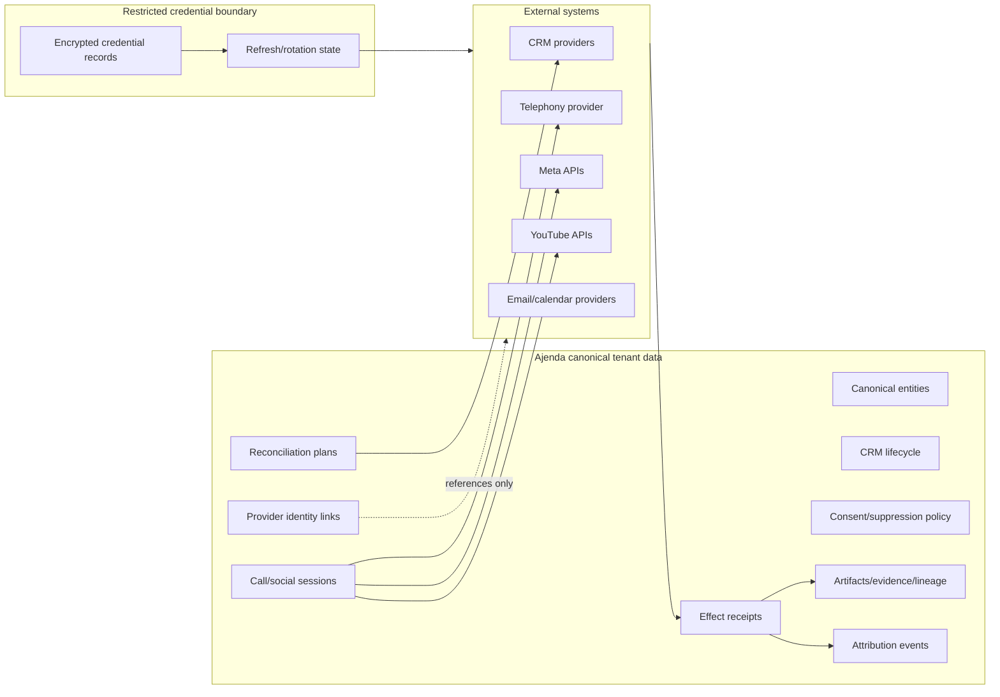

### Proposed logical resources

These are logical resources, not approved table names:

| Resource | State owner | Primary uniqueness/concurrency requirement | Retention concern |
| --- | --- | --- | --- |
| canonical entity | identity domain | tenant + canonical ID; controlled merge/split | durable business record |
| provider identity link | identity domain | tenant + provider + account + provider object ID | delete/unlink history |
| lifecycle record | CRM domain | tenant + entity + lifecycle version | durable transitions |
| consent/suppression decision | policy domain | subject/channel/jurisdiction/effective interval | legal/policy retention |
| communication session | channel domain | provider event/session ID dedupe | bounded transcript/message retention |
| reconciliation plan | CRM domain | desired-state hash + observation version | retain through resolution |
| effect claim/receipt | runtime/evidence | idempotency key + request hash | durable replay evidence |
| attribution event | attribution domain | immutable event ID + correction linkage | model/version lineage |

## 19. Ingress and callback graph

Provider callbacks are observations, not a second execution spine.

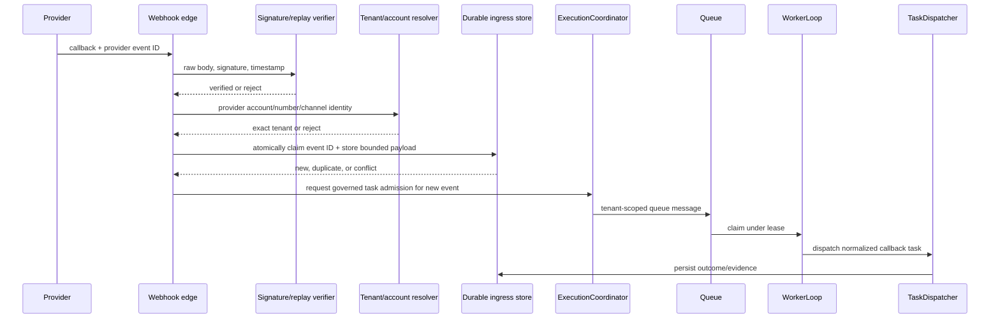

Ingress may authenticate, resolve tenant, deduplicate, persist a bounded observation, and request ordinary task admission. It may not directly run receptionist logic, mutate CRM, publish, send, or declare mission completion.

## 20. Channel capability matrix

| Capability | Phone | Facebook | Instagram | YouTube | Initial wave |
| --- | --- | --- | --- | --- | --- |
| Account/number metadata read | yes | yes | yes | yes | read-only |
| Event/webhook ingestion | call events | page/message/lead events | comment/mention/message events where supported | comment/channel events | read-only |
| Content/interactions read | transcript/status | posts/comments/messages/leads | media/comments/mentions/messages where supported | videos/comments/channel data | read-only |
| Draft/proposal | script/response | reply/post draft | reply/caption draft | reply/title/description draft | internal decision |
| Human-approved reply | call response/transfer | comment/message | comment/message where supported | comment moderation/reply | controlled effect |
| Human-approved publish | outbound call | page post/media | professional-account media | video/community surface where supported | late controlled effect |
| Read-back verification | call disposition/recording status | object/message status | media/message status | upload/video/comment status | required with effects |
| Lead/identity reconciliation | caller/contact | lead/social identity | social identity | commenter/channel identity | identity foundation |

Exact provider feature availability, app-review requirements, scopes, rate limits, and webhook semantics must be verified against current official provider documentation during each adapter LAP. This design does not claim that every conceptual capability is available from every provider account type.

## 21. State machines

### 21.1 External effect state

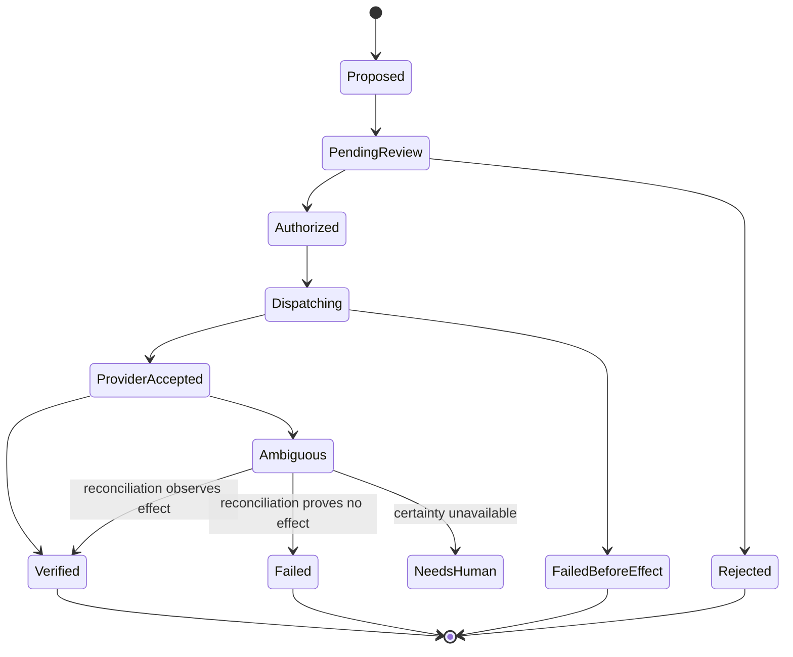

Only `FailedBeforeEffect` is automatically retryable, and only when the idempotency contract permits it. `Ambiguous` is never treated as failure for blind retry.

### 21.2 Call session state

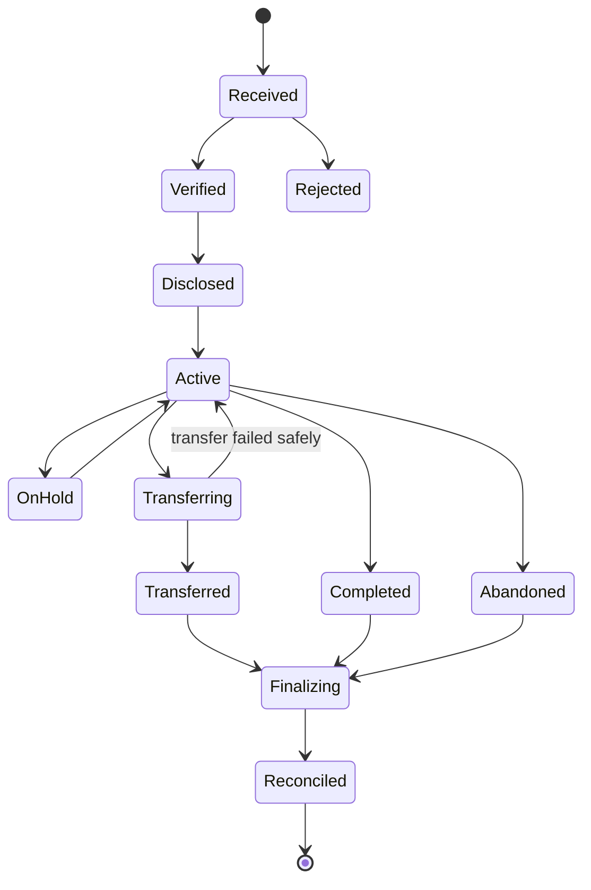

### 21.3 Social publication state

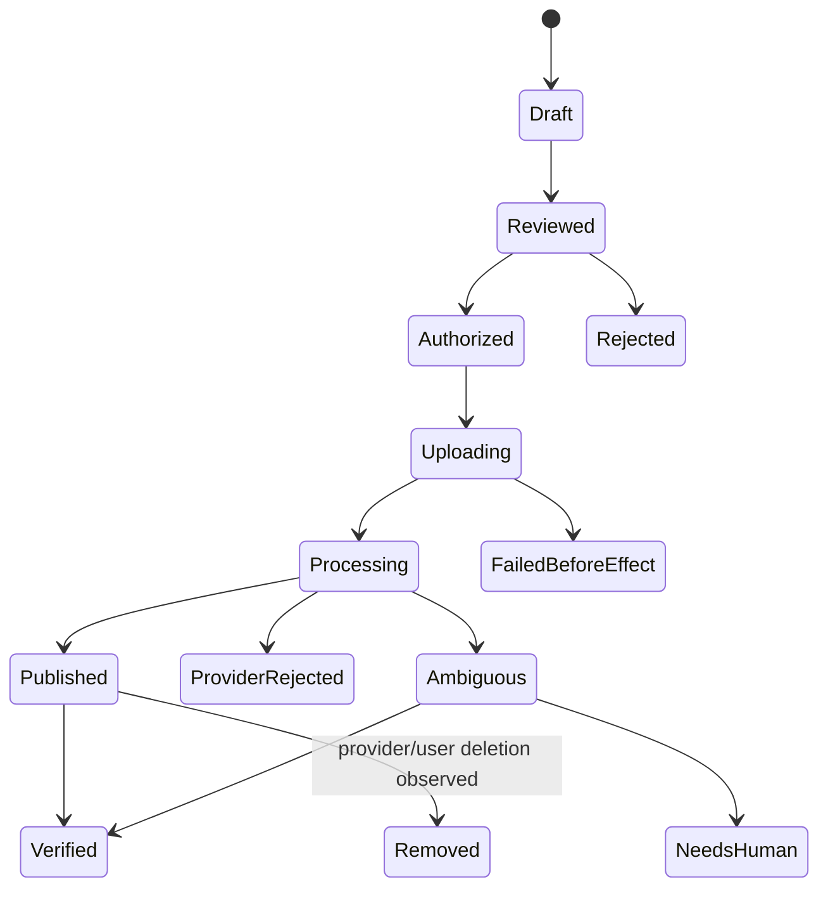

## 22. Failure and recovery matrix

| Failure | Required state | Automatic behavior | Human-visible evidence |
| --- | --- | --- | --- |
| intent ambiguous | composition blocked | request clarification | unmatched/conflicting clauses |
| charter lacks action | admission blocked | do not materialize rejected node | exact node, action, permission, remediation |
| credential missing/undecryptable | connection blocked | no external task dispatch | credential reference and safe reason, never secret |
| graph dependency unavailable | graph blocked or conditional branch omitted | no dangling consumer | dependency/applicability decision |
| source unavailable | partial research | continue only if acceptance permits | missing source and affected claims |
| identity collision | `ambiguous` | prohibit merge/mutation | conflicting identifiers |
| provider rate limit before effect | retry scheduled by policy | bounded backoff | attempt count and provider code |
| timeout after request transmission | `ambiguous` | reconcile before retry | request hash/idempotency key |
| callback duplicate | already consumed | acknowledge without re-execution | original event/task linkage |
| callback tenant cannot resolve | rejected/quarantined | no task admission | provider account reference and reason |
| queue succeeds but DB transition fails | visible compensation state | release/compensate via existing runtime policy | queue and DB outcomes |
| CRM read-back conflicts | reconciliation conflict | no silent overwrite | desired/observed versions |
| phone transfer fails | session remains controlled | return to receptionist/escalate | transfer attempt/result |
| transcript/recording prohibited | metadata-only outcome | discard/not acquire content | applied retention/consent rule |
| publish accepted then removed | verified then removed | observe and reconcile | provider object ID and removal observation |
| all tasks terminal, artifacts missing | mission incomplete/failed | reconcile once; no false completion | missing artifact contracts |

## 23. Trust boundaries and abuse cases

| Boundary | Threat/abuse case | Canonical control |
| --- | --- | --- |
| Public/provider callback → Ajenda | forged or replayed event | raw-body signature verification, timestamp window, event claim |
| Provider identifier → tenant | cross-tenant routing | exact tenant-owned account/number mapping; fail closed |
| External content → model/tool | prompt injection or malicious URL | content treated as untrusted data; bounded retrieval and egress policy |
| Caller/social user → CRM | identity spoofing | evidence-based identity resolution; no single weak identifier merge |
| Planner → side effect | self-issued permission | independent task/payload-bound authorization |
| Adapter → network | SSRF/destination substitution | shared `NetworkEgressAuthority` and provider allow-list/host rules |
| Retry → provider | duplicated call/post/write | durable idempotency/effect state and read-back reconciliation |
| Transcript/message → evidence | secret or sensitive-data leakage | minimization, redaction, sensitivity labels, retention policy |
| Provider callback → runtime | bypass of queue/lease | callback only requests canonical task admission |
| Analytics → decision | vanity metric treated as causal fact | versioned attribution model and explicit limitations |

## 24. Parallel-window dependency DAG

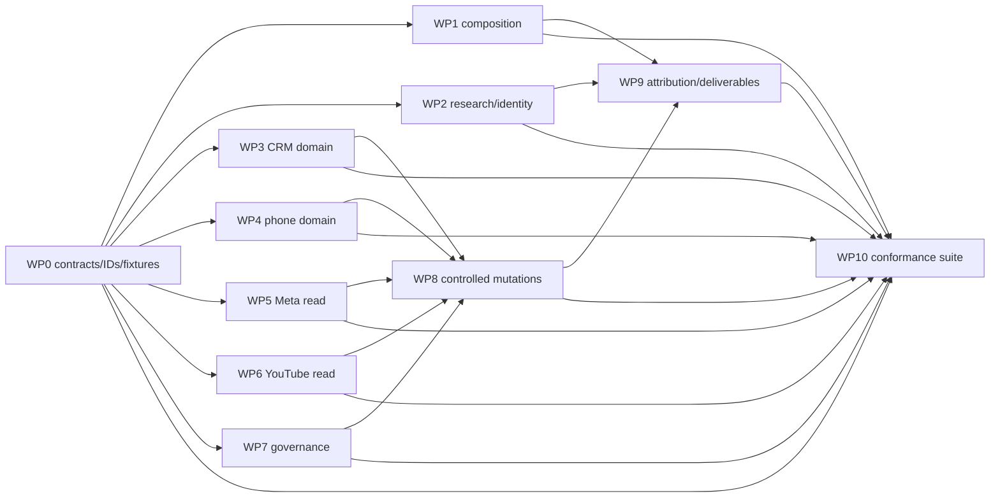

### Integration rules for concurrent windows

1. WP0 publishes the contract package and fixture hashes before other windows merge implementation.
2. Each window pins the contract version it consumes; it cannot silently track the latest branch version.
3. Provider windows may add adapter-private response types but must return the frozen canonical result type.
4. Shared runtime files remain owned by the runtime/governance window during an active integration wave.
5. Migration revisions are allocated before parallel database work to avoid competing heads.
6. Every window supplies consumer-driven contract tests for its inputs and producer-driven tests for its outputs.
7. The integration window merges in dependency order, regenerates the existing dependency graph, and runs graph impact/proof selection after each subgraph merge.

## 25. Scenario suite for design adjudication

The canonical graph is incomplete until these instantiated scenarios can be represented without inventing authority or state:

| Scenario | Required branches | Expected terminal result |
| --- | --- | --- |
| five-platform public research report | research → identity → corroboration → qualification → synthesis | completed with five resolved companies or explicit acceptance failure/gaps |
| research with misleading comparison articles | source extraction → identity rejection/ambiguity | articles remain sources, not prospects |
| CRM duplicate reconciliation | observe → identity collision → merge proposal → review | no automatic merge |
| inbound sales call | verified callback → disclosure/consent → receptionist → appointment proposal → CRM proposal | completed with disposition and governed follow-up |
| inbound support call with unknown identity | callback → ambiguous caller → bounded response/escalation | no unsafe account disclosure |
| outbound follow-up call | CRM trigger → suppression/consent/jurisdiction → authorization → call → read-back | effect verified or ambiguous; never blind retry |
| Facebook lead form | verified event → social identity → company/person resolution → CRM proposal | deduplicated lead with provenance |
| Instagram comment response | observe → moderate → draft → authorization → reply → read-back | exact approved reply verified |
| YouTube video publication | draft/assets → review → authorization → resumable upload → processing → read-back | verified publication or explicit ambiguous/rejected state |
| revoked provider credential mid-mission | preflight passes, runtime resolution fails | affected branch fails closed; unrelated branches reconcile normally |
| duplicated webhook and worker retry | durable event claim + idempotent task/effect handling | one logical outcome/effect |
| all runtime tasks complete but report invalid | terminal tasks → artifact validation → reconciliation | mission not falsely marked complete |

## 26. Definition of graph-complete

The G.R.A.F.T.1st design is ready to allocate across windows only when:

- Every requested capability maps to stable node keys.
- Every node has one canonical responsibility and owner.
- Every hard edge names a typed, versioned artifact.
- Conditional edges have explicit applicability predicates.
- Every external read/write/send/publish/call names credential, network, tenant, and evidence authorities.
- Every mutation has an idempotency and ambiguous-effect strategy.
- Every provider callback rejoins the canonical task runtime.
- Every persisted state resource has an owner, tenant boundary, transition rules, and retention class.
- Every terminal outcome is expressible without equating task success with artifact/effect success.
- Each parallel work package can state what it owns without editing another package's contracts.
- Scenario adjudication records `SATISFIED`, `VIOLATED`, or `INDETERMINATE` with evidence.
- The observed implementation has been reconciled separately and no proposed node is presented as shipped.

## 27. Lock-pass decision ledger

This section freezes architectural decisions for implementation planning. `LOCKED` means a work window must not change the decision without a versioned architecture amendment. `OWNER INPUT` means implementation that depends on the choice remains blocked, while unrelated subgraphs may proceed.

| Decision ID | Decision | Status | Reason/change rule |
| --- | --- | --- | --- |
| `D-GC-001` | The addition extends Ajenda's existing mission and runtime spine; it creates no vertical-owned execution engine. | LOCKED | Required by runtime authority invariants. |
| `D-GC-002` | The canonical graph is declarative; only admitted `ExecutionTask` work can execute. | LOCKED | Capability/adapter/graph metadata cannot grant runtime authority. |
| `D-GC-003` | Canonical dependency direction is consumer → dependency; execution diagrams may use flow direction. | LOCKED | Matches the existing dependency graph. |
| `D-GC-004` | Ajenda owns canonical entity identity, CRM lifecycle, consent state, mission state, and evidence. | LOCKED | Providers are observations/adapters, not domain authorities. |
| `D-GC-005` | Phone, Facebook, Instagram, and YouTube use separate actions by operation and side-effect class. | LOCKED | Read, draft, reply, send, upload, publish, and call are not interchangeable. |
| `D-GC-006` | Provider callbacks authenticate, deduplicate, persist bounded observations, and request ordinary task admission. | LOCKED | Prevents a callback execution bypass. |
| `D-GC-007` | External effects require operating-charter permission and independent task/payload-bound authorization. | LOCKED | Connectivity and planning do not authorize effects. |
| `D-GC-008` | External mutations use durable idempotency state, effect certainty, and read-back verification. | LOCKED | Prevents duplicate effects and synthetic completion. |
| `D-GC-009` | `ambiguous` effect state prohibits blind retry. | LOCKED | Timeout/partial-response safety. |
| `D-GC-010` | Identity ambiguity prohibits automatic merge or irreversible CRM mutation. | LOCKED | Protects entity integrity. |
| `D-GC-011` | Evidence keeps observation, inference, contradiction, and gap distinct. | LOCKED | Required for honest synthesis and qualification. |
| `D-GC-012` | Task terminality, artifact completeness, effect verification, and mission completion are separate dimensions. | LOCKED | Existing deliverable doctrine. |
| `D-GC-013` | Contract schemas are additive within a minor version; breaking semantics require a new major version. | LOCKED | Allows independent windows to pin interfaces. |
| `D-GC-014` | Read-only provider integrations precede external mutations. | LOCKED | Reduces authority and provider-risk surface. |
| `D-GC-015` | Outbound phone activation requires an approved consent/jurisdiction policy matrix. | LOCKED | High-risk external communication boundary. |
| `D-GC-016` | Exact telephony provider selection is deferred behind the canonical phone adapter contract. | DEFERRED | Provider choice must not block domain work. |
| `D-GC-017` | Meta and YouTube capabilities are limited to scopes genuinely available to the tenant's provider account/app approval. | LOCKED | No simulated or assumed provider capability. |
| `D-GC-018` | Numeric qualification, promotion, budget, and quality thresholds require owner approval. | OWNER INPUT | Repository baseline explicitly leaves these unapproved. |
| `D-GC-019` | Recording/transcript default retention and supported jurisdictions require owner/legal policy approval. | OWNER INPUT | Cannot be inferred safely from architecture. |
| `D-GC-020` | Autonomous external effects are outside the initial release; effects remain human-authorized. | LOCKED | Safe initial product boundary. |

## 28. Frozen interface manifest

The first implementation wave freezes names and ownership, not every future payload field. WP0 must materialize these as versioned code contracts before other windows merge.

| Interface package | Version to create | Owner | Stability boundary | Initial consumers |
| --- | --- | --- | --- | --- |
| `ajenda.mission.graph` | `2.0.0` | mission composition | node/edge identity, applicability, typed bindings | admission, materializer, UI |
| `ajenda.artifact.envelope` | `1.0.0` | evidence/artifact domain | provenance, tenant, content hash, sensitivity | every artifact producer/consumer |
| `ajenda.identity` | `1.0.0` | identity domain | canonical refs and match decisions | research, CRM, phone, social |
| `ajenda.research` | `2.0.0` | research domain | source/claim/corroboration/report artifacts | qualification, reports, CRM planning |
| `ajenda.crm` | `2.0.0` | CRM domain | canonical lifecycle and reconciliation | adapters, engagement, attribution |
| `ajenda.communication.policy` | `1.0.0` | governance domain | consent, suppression, jurisdiction, authorization | phone, email, social |
| `ajenda.phone` | `1.0.0` | receptionist domain | events, sessions, dispositions, transfer/call requests | telephony adapters, CRM, evidence |
| `ajenda.social` | `1.0.0` | social domain | normalized account/content/interaction/publication | Meta/YouTube adapters, CRM, attribution |
| `ajenda.effect` | `1.0.0` | runtime/evidence boundary | idempotency, effect certainty, receipts, read-back | every external mutation |
| `ajenda.attribution` | `1.0.0` | attribution domain | observations and model/version lineage | reports, outcome review, knowledge |

### Freeze rules

- Stable node keys, artifact type names, state meanings, and authority ownership are frozen at architecture lock.
- Initial implementation may refine optional fields through WP0, but cannot weaken tenant, authorization, evidence, or failure semantics.
- A consumer must reject unknown major schema versions.
- A producer must not emit a newer contract version than the graph instance declares.
- Persisted missions retain their original know-how and contract versions.
- Contract removal is forbidden while a persisted mission or artifact references the version.

## 29. Proposed action namespace

Action names are frozen as design identifiers. Runtime registration still requires the ability rollout checklist, schemas, handlers, authority, evidence, and tests.

| Action | Effect class | Default | Required artifact |
| --- | --- | --- | --- |
| `research.extract_claims` | `internal_read`/none | enabled after proof | `ObservedClaim[]` |
| `identity.resolve_company` | `internal_write` when persisted | enabled after proof | `IdentityMatchDecision` |
| `identity.resolve_person` | `internal_write` when persisted | enabled after proof | `IdentityMatchDecision` |
| `evidence.corroborate` | none | enabled after proof | `CorroborationBundle` |
| `crm.observe_state` | `internal_read` or `external_read` | disabled for external by default | `CRMObservation` |
| `crm.plan_reconciliation` | none | enabled after proof | `CRMReconciliationPlan` |
| `crm.apply_reconciliation` | `internal_write` or `external_write` | disabled | `CRMMutationResult` |
| `crm.verify_effect` | `internal_read` or `external_read` | paired with mutation | `CRMReadbackResult` |
| `phone.receive_event` | `internal_write` | disabled until ingress proof | `CallEvent` |
| `phone.receptionist_turn` | `external_send`/call control | disabled | `ConversationTurnResult` |
| `phone.transfer_call` | `external_send`/call control | disabled | `TransferResult` |
| `phone.initiate_outbound` | `external_send` | disabled | `CallInitiationResult` |
| `phone.finalize_call` | `external_read` + internal artifacts | disabled until provider proof | `CallOutcome` |
| `facebook.observe` | `external_read` | disabled until credential proof | social observation |
| `facebook.reply` | `external_send` | disabled | `PublicationResult` |
| `facebook.publish` | `external_publish` | disabled | `PublicationResult` |
| `instagram.observe` | `external_read` | disabled until credential proof | social observation |
| `instagram.reply` | `external_send` | disabled | `PublicationResult` |
| `instagram.publish` | `external_publish` | disabled | `PublicationResult` |
| `youtube.observe` | `external_read` | disabled until credential proof | social observation |
| `youtube.moderate_comment` | `external_write` | disabled | `ModerationResult` |
| `youtube.reply` | `external_send` | disabled | `PublicationResult` |
| `youtube.publish_video` | `external_publish` | disabled | `PublicationResult` |
| `social.verify_effect` | `external_read` | paired with mutation | `PublicationReadback` |
| `attribution.record_observation` | `internal_write` | enabled after proof | `AttributionEvent` |

`internal_read`/none in this table must be reconciled with the repository's actual `SideEffectClass` enum during WP0; no new enum value may be invented casually. Phone call control also requires an explicit classification decision if existing `external_send` semantics are insufficient.

## 30. Shared-file and merge ownership plan

Exact new paths are proposals and must be reconciled against implementation conventions before creation. Existing shared files are listed to prevent simultaneous edits.

| Area | Likely shared entry points | Parallel-write rule |
| --- | --- | --- |
| Contract types | `backend/services/mission_composition/contracts.py`, tool schemas | WP0 owns during freeze; later packages add domain-local modules |
| Vertical selection | `vertical_know_how.py`, job/action catalogs, compiler/resolver | WP1 owns during composition wave |
| Action registration | ability catalog, action registry, tool schemas | staged integration commits; provider windows do not edit concurrently |
| Runtime/admission | worker runtime, coordinator, G.R.A.F.T. validators | WP7 owns; domain windows consume interfaces |
| Network egress | shared egress authority and credential resolver | WP7 owns common changes; adapters remain isolated |
| Migrations | `alembic/versions/` | revision IDs allocated centrally; one merge head per wave |
| Provider adapters | domain-specific adapter modules | Meta, YouTube, and telephony windows remain separate |
| Evidence/deliverables | evidence contracts, deliverable assembler, reconciliation | WP9 owns integration changes |
| Tests/fixtures | domain-local tests plus frozen conformance fixtures | fixtures owned by WP0/WP10; implementations cannot rewrite expected behavior |

## 31. Owner-input register

These inputs do not prevent the architecture lock. They block only the named implementation branches.

| Input ID | Decision needed | Blocks | Safe default until decided |
| --- | --- | --- | --- |
| `OI-01` | RevOps qualification rubric and numeric thresholds | automatic qualification/promotion | report evidence and `INDETERMINATE`; no automatic promotion |
| `OI-02` | Operational budgets: search volume, calls, messages, uploads, spend/time | release promotion and runtime quotas | conservative development-only limits |
| `OI-03` | Supported phone jurisdictions and consent rules | outbound calls and recording | inbound metadata/minimal receptionist only; recording/outbound disabled |
| `OI-04` | Transcript/recording retention and deletion policy | durable audio/transcript storage | do not retain recordings; minimize transcript artifacts |
| `OI-05` | Initial telephony provider | adapter implementation | keep canonical adapter contract provider-neutral |
| `OI-06` | Meta and YouTube initial account/app approval scope | exact adapter feature set | read-only discovery/proof; unsupported operations blocked |
| `OI-07` | Human approval model for CRM writes/social/phone | controlled-effect release | task/payload-bound individual approval |
| `OI-08` | Attribution model and decision-use policy | optimization/learning claims | descriptive observations only; no causal claim |

## 32. Architecture lock checklist

| Lock condition | Result | Evidence/location |
| --- | --- | --- |
| System boundary defined | SATISFIED | §§1, 3–5 |
| Existing runtime authority preserved | SATISFIED | §§3, 10, 19, `D-GC-001`–`007` |
| Domains and canonical owners defined | SATISFIED | §§5–6, 15 |
| Stable node vocabulary defined | SATISFIED | §15 |
| Typed edges and applicability defined | SATISFIED | §16 |
| Cross-domain contract families defined | SATISFIED | §§7, 17, 28 |
| State and persistence ownership defined | SATISFIED | §§9, 18, 21 |
| External-effect semantics defined | SATISFIED | §§17, 21–23 |
| Callback path returns to canonical runtime | SATISFIED | §19 |
| Phone/social capability boundaries defined | SATISFIED | §§5, 20, 29 |
| Failure/recovery behavior defined | SATISFIED | §22 |
| Parallel work boundaries defined | SATISFIED | §§11, 24, 30 |
| Scenario coverage defined | SATISFIED | §25 |
| Proof obligations defined | SATISFIED | §13 |
| Owner-only choices isolated | SATISFIED | §§27, 31 |
| Observed implementation fully reconciled to every node | INDETERMINATE | requires a fresh G.R.A.F.T.+ code/runtime sweep after current work is committed |
| WP0 code contracts materialized and conformance-tested | NOT STARTED | first implementation package |

## 33. Lock declaration

The **G.R.A.F.T.1st architecture is conditionally locked at the design level** when this document is reviewed and accepted. The lock covers system boundaries, authority, node identities, dependency semantics, contract families, state meanings, ownership, side-effect rules, callback behavior, work-package boundaries, and proof obligations.

The lock does not claim implementation, provider availability, legal approval, release readiness, or observed-system conformance. Those remain gated by the owner-input register, WP0 contract materialization, implementation tests, provider proofs, and a post-implementation G.R.A.F.T.+ reconciliation.

After acceptance, further mapping passes should occur only when one of these is true:

1. an instantiated scenario cannot be represented;
2. a source-of-truth inspection disproves a locked assumption;
3. an owner decision changes a boundary;
4. a provider constraint requires a canonical contract change rather than an adapter-only change; or
5. a work window proposes a breaking interface amendment.

## 34. Intermingling simulation pass

The lock was exercised through the declarative suite at
`tests/fixtures/graft1st/intermingling_simulations.v1.json`. The validator checks canonical node
identity, dependency closure, cycles, and unordered access to shared state. This is architecture
simulation, not provider, database-atomicity, or live-runtime proof.

| Simulation | Intermingled paths | Result | Design consequence |
| --- | --- | --- | --- |
| `SIM-001` | public research + Facebook lead + identity + CRM planning | SATISFIED | Research and social observations converge at one identity owner; neither source writes CRM directly. |
| `SIM-002` | inbound call + CRM observation + person identity + receptionist | SATISFIED with identity `INDETERMINATE` | An uncertain caller may receive bounded public assistance but no account-specific disclosure. |
| `SIM-003` | approved social draft + credential revocation | expected `VIOLATED` preflight | Content approval and credential usability are independent gates; no publish task or receipt is created. |
| `SIM-004` | call outcome + current CRM state + reconciliation + mutation + read-back | SATISFIED | Phone finalization emits an observation; one CRM plan serializes the effect and verification. |
| `SIM-005` | terminal research work + invalid report + mission reconciliation | expected `VIOLATED` completion | Task terminality cannot override typed artifact failure. |

### Cross-domain join points

The simulation identifies six locations where independent windows must deliberately converge:

1. **Identity join:** research, CRM, phone, and social produce observations; only identity resolution
   selects or creates canonical entities.
2. **Policy join:** channel drafts, destinations, consent, charters, and reviewer grants meet before
   any external effect.
3. **CRM join:** call/social/research outcomes become desired-state inputs; only CRM reconciliation
   computes provider mutations.
4. **Effect join:** mutation result, idempotency state, provider identifier, and read-back determine
   effect certainty.
5. **Evidence join:** observations and effect receipts become typed evidence without erasing gaps,
   contradictions, or sensitivity rules.
6. **Completion join:** task states, artifact validity, approval state, and effect certainty meet in
   mission reconciliation.

### Concurrency rules discovered by simulation

- Independent source reads and distinct provider-event claims may run concurrently.
- Two steps may read the same canonical resource concurrently.
- Any write or claim sharing a resource with another unordered access is a graph defect unless a
  future storage contract proves an atomic commutative operation and the simulation contract is
  explicitly amended.
- Provider callbacks sharing an event ID converge through one durable claim before task admission.
- Multiple channel observations for one entity converge before canonical identity or CRM mutation.
- External effects for the same canonical record serialize through reconciliation/version checks,
  even when their upstream observations ran concurrently.
- Approval, credential readiness, provider effect, and read-back are separate ordered states.

### Simulation proof boundary

The suite proves that the design expresses safe ordering and exposes shared-state collisions. It
does not prove Redis claims, PostgreSQL constraints, RLS, provider idempotency, webhook signatures,
network behavior, model quality, or actual effect reconciliation. Those remain implementation and
integration proof obligations in §§13 and 22.
