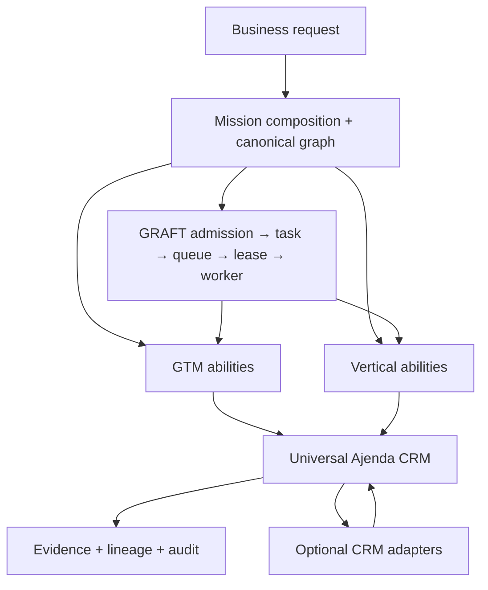
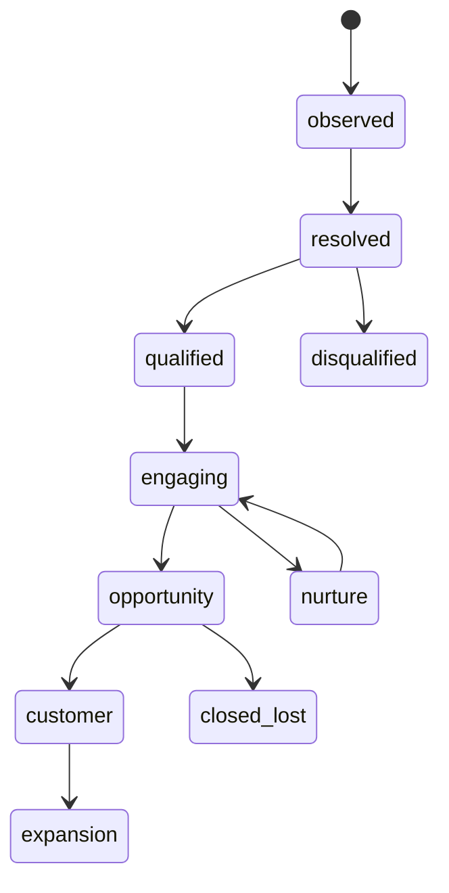

# G.R.A.F.T.1st — Universal CRM Canonical Map

**Status:** design contract for the Ajenda internal CRM evolution

**Scope:** A tenant-owned, vertical-neutral system of record that GTM abilities and
vertical abilities consume through the existing mission graph and governed runtime.

This map does not create a second runtime, planner, queue, policy authority, or
provider truth store. External CRMs remain optional adapters. Ajenda owns the
canonical identity, relationship, lifecycle, evidence, and audit model.

## 1. Architectural position



The CRM is the durable canonical business state. GTM and vertical abilities are
workers that observe or propose changes to that state. A connector may provide
external observations or execute an explicitly authorized mutation, but cannot
replace Ajenda identity or lifecycle authority.

## 2. Universal core entities

| Entity | Purpose | Minimum stable identity | Lifecycle owner |
| --- | --- | --- | --- |
| `organization` | The tenant's business and operating profile | tenant + organization id | Business Profile / CRM |
| `account` | Customer, prospect company, partner, or vendor | tenant + account id; domain when known | CRM |
| `contact` | Person associated with an account or opportunity | tenant + contact id; normalized email when known | CRM |
| `lead` | Unqualified signal that may resolve to a contact/account | tenant + lead id; source reference | CRM + research evidence |
| `opportunity` | Revenue or outcome pursuit | tenant + opportunity id | CRM |
| `activity` | Immutable interaction or observation | tenant + activity id | CRM / channel ability |
| `task` | Human or agent work item | tenant + task id | Mission runtime / CRM projection |
| `appointment` | Scheduled meeting, visit, or service event | tenant + appointment id | Calendar/vertical ability |
| `job` | Fulfillment or operational engagement after opportunity | tenant + job id | Vertical extension |
| `document` | Proposal, estimate, transcript, attachment, or evidence package | tenant + document id | Document/evidence authority |
| `relationship` | Explicit typed link between two records | tenant + relationship id | CRM |

`lead` may resolve into `contact` and `account`; it must not become a second
identity for the same person or company after resolution. `job` is intentionally
generic so service businesses can add operational work without changing the
revenue model.

## 3. Stable core fields

Every record has a stable id, tenant id, record type, created/updated timestamps,
source, provenance, and soft-delete state. Domain records additionally contain:

### Account

`name`, `legal_name`, `domain`, `phone`, `email`, `address`, `industry`,
`lifecycle_stage`, `owner_id`, `status`, `source`, `tags`, `custom_fields`.

### Contact

`name`, `first_name`, `last_name`, `email`, `phone`, `title`, `account_id`,
`lifecycle_stage`, `owner_id`, `consent_status`, `preferred_channels`, `source`,
`tags`, `custom_fields`.

### Lead

`source`, `source_record_id`, `observed_at`, `account_id`, `contact_id`,
`qualification_status`, `qualification_score`, `qualification_reasons`,
`evidence_refs`, `owner_id`, `custom_fields`.

### Opportunity

`name`, `account_id`, `primary_contact_id`, `stage`, `amount`, `currency`,
`probability`, `expected_close_at`, `owner_id`, `next_action`, `loss_reason`,
`source`, `custom_fields`.

### Activity

`activity_type`, `subject`, `body`, `occurred_at`, `channel`, `direction`,
`related_type`, `related_id`, `actor_type`, `actor_id`, `mission_id`, `task_id`,
`artifact_id`, `provider_event_id`, `evidence_refs`, `custom_fields`.

### Relationship

`from_type`, `from_id`, `relationship_type`, `to_type`, `to_id`, `is_primary`,
`valid_from`, `valid_to`, `source`, `evidence_refs`.

Unknown or vertical-specific values belong in `custom_fields` only while their
semantics remain tenant-local. A repeated cross-vertical concept graduates into
the core through an additive contract and migration; it is never silently
reinterpreted.

## 4. Canonical lifecycle



Provider stages are mapped into this lifecycle through versioned adapter
contracts. A provider cannot change the meaning of `qualified`, `customer`, or
`closed_lost` by returning a similarly named stage.

## 5. Vertical extension contract

Verticals may add:

- typed extension objects (`roof`, `matter`, `patient`, `property`, `job`);
- extension fields and validation rules;
- vertical lifecycle transitions and required evidence;
- vertical abilities that read or propose updates to core CRM records;
- vertical-specific mission graph nodes.

Verticals may not add:

- a competing identity store;
- a second account/contact/opportunity lifecycle;
- direct queue or worker execution;
- implicit authorization from a connector or credential;
- un-audited mutation of a core CRM record.

Example roofing extension:

```json
{
  "record_type": "opportunity",
  "data": {
    "account_id": "acct_123",
    "stage": "qualified",
    "vertical": "roofing",
    "extension": {
      "property_address": "...",
      "roof_type": "...",
      "inspection_status": "scheduled",
      "estimated_value": 12500
    }
  }
}
```

The opportunity remains a universal CRM opportunity; roofing owns only the
extension semantics and related abilities.

## 6. Authority and dependency contracts

| Contract | Owner | Consumer | Required proof |
| --- | --- | --- | --- |
| identity upsert | CRM repository/service | research, GTM, verticals | deterministic dedupe + tenant test |
| relationship mutation | CRM service | lifecycle abilities | foreign-record and cycle checks |
| lifecycle transition | CRM service | qualification, GTM, verticals | transition matrix + audit |
| custom field schema | tenant/vertical profile | CRM validation | schema version + malformed-input tests |
| activity append | CRM service | all channel abilities | immutable timeline + provenance |
| external reconciliation | connector adapter | CRM service | desired/observed diff + read-after-write |
| mission projection | runtime/evidence owner | CRM read models | task/mission/evidence lineage |

The mission graph owns execution order. The CRM owns business-record state. The
vertical owns domain semantics. Evidence and audit remain cross-cutting proof,
not an alternate data model.

## 7. Canonical GTM interaction graph

```mermaid
flowchart LR
    SOURCE[Research/source observation] --> LEAD[Lead]
    LEAD --> RESOLVE[Identity resolution]
    RESOLVE --> CONTACT[Contact + account]
    CONTACT --> QUAL[Qualification]
    QUAL --> OPP[Opportunity]
    OPP --> ENGAGE[Draft / approve / communicate]
    ENGAGE --> ACTIVITY[Activity timeline]
    ACTIVITY --> STAGE[Lifecycle transition]
    STAGE --> JOB[Customer/job handoff]
    JOB --> OUTCOME[Outcome + attribution evidence]
```



Every edge is represented by a typed artifact or persisted CRM record. A prose
summary is not sufficient proof of identity, qualification, stage transition, or
customer outcome.

## 8. Implementation sequence

1. Freeze typed core schemas and normalization rules while retaining the current
   `tenant_internal_records` storage boundary.
2. Add relationship, owner, lifecycle-history, and custom-field validation.
3. Add deterministic identity resolution and duplicate/merge proposals.
4. Expand CRM API and UI around account/contact/opportunity/activity timelines.
5. Bind GTM abilities to canonical CRM mutations through missions and evidence.
6. Add one affordable external connector only after the internal contract is
   proven; adapter choice follows customer demand.
7. Add vertical extension schemas and representative simulations (roofing plus a
   non-service vertical) against the same core.

## 9. Non-negotiable invariants

- Tenant identity is authenticated and repository-scoped on every read/write.
- Core record identity is deterministic and duplicate-safe.
- Stage transitions are explicit, versioned, and audited.
- External credentials never grant CRM authority by themselves.
- External writes require mission admission, side-effect authorization,
  idempotency, and read-after-write evidence.
- Vertical extensions cannot fork CRM truth or bypass the runtime spine.
- Deleted records remain auditable and cannot be silently recreated as duplicates.

## 10. Lock decision

This map is the target contract for the internal CRM evolution. The first code
slice should extend the existing internal-record service and schemas rather than
introduce a parallel CRM database. Completion requires implementation, focused
tenant/identity/lifecycle tests, migration parity, and runtime evidence.
