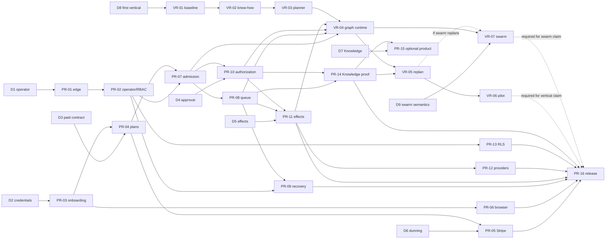

# End-to-end audit remediation execution plan

**Plan date:** 2026-08-16  
**Finding baseline:** `main@7ccadea5a9da7700ccf9b0ccd6087c027bff9a12`  
**Mainline identity:** merge commit for GitHub PR `#434` on `main`
**Verification artifact:**
[`docs/audits/END_TO_END_FINDINGS_VERIFICATION_2026-08-16.md`](../audits/END_TO_END_FINDINGS_VERIFICATION_2026-08-16.md)  
**Status:** Proposed execution contract; no item is complete until its required artifact and proof
exist.  
**Accountable owner:** Obex Blackvault  
**Delivery owner:** Ajenda-AI engineering lead

**V1 scope decision:** choose one of the five bounded finish lines in
[`docs/planning/V1_DELIVERY_PATHS.md`](../planning/V1_DELIVERY_PATHS.md). The recommended product
finish is Path 3, a single outcome-complete vertical worker; this recommendation is not owner
authorization.

## 1. Objective and release decision

Close every confirmed audit finding without weakening tenant isolation, queue authority, lease
ownership, policy review, evidence, retry safety, or schema compatibility. Work is divided into
small, ordered PRs so each authority change is independently reviewable, testable, deployable, and
reversible.

**Current release decision:** do not describe or promote the audited revision as a stranger-facing
production API. Promotion remains blocked until the P0 exit gate in section 8 is satisfied with
runtime artifacts. Green unit tests or updated documentation alone cannot clear the gate.

This plan does not silently choose unresolved product policy. Section 4 records the decisions that
Obex must approve before the affected implementation PR begins. Recommended defaults are supplied
so work can be estimated and sequenced without treating recommendations as authority.

### Product-capability correction

The original version of this plan was an audit-closure plan, not a complete vertical-runtime
delivery plan. It hardened the execution spine and repaired Knowledge provenance, but it did **not**
by itself make Ajenda capable of reliably decomposing and completing unfamiliar, complex prompts.
Treating PR-14/PR-15 or the existing vertical templates as sufficient for that product goal would
be incorrect.

The repository already contains two useful but incomplete planning surfaces:

- Mission Composition deterministically interprets a bounded canonical-outcome vocabulary,
  resolves a fixed business-job catalog, and compiles a declarative graph. Confirmation deliberately
  stops before runtime task materialization and queue admission.
- Vertical Ops supplies fixed research/email/social runtime templates and plan-only
  ads/code/finance templates. Queueable templates correctly enter the existing
  `ExecutionCoordinator`; they are not a second worker runtime.

Those surfaces prove safe composition for known cases, not general complex-prompt competence.
They do not yet provide model-backed decomposition, a reusable vertical know-how contract,
artifact/dataflow binding across arbitrary multi-step work, replanning from observed results,
or end-to-end vertical outcome evaluation. Section 6 now adds a separate vertical-capability track
that extends these surfaces while converging the **current two authority spines** into one runtime
authority under PR-08.

The two current spines are the daemon `WorkerLoop`/`WorkerRuntimeService` path and the synchronous
HTTP mission-bridge claim/start/run path. They converge on the same queue adapter, lease table,
`TaskDispatcher`, and `ToolRuntimeAuthority`, so they are not separate tool engines; however, they
independently own claim/start/run transitions and can compete for an admitted queue payload. The
Ajenda Brain is not another production runtime: its mission list is a readiness/demo catalog and
`ajenda_brain` is a registered-action provider/provenance label.

## 2. PRIDE / UPG / LAP preflight

### Responsibility

- Accept the verified findings and convert them into bounded implementation work.
- Decide or explicitly defer product-policy choices.
- Produce implementation, migration, tests, runtime evidence, operational rollback, and corrected
  documentation for every claim closed.
- Do not combine independent high-risk changes merely to reduce PR count.

### Sources of truth

1. Runtime implementation and migrations named by each work item.
2. Existing unit, contract, integration, deployment, and live-proof tests.
3. `PROJECT_SPEC.md` invariants and `docs/contracts/authority-ledger.v1.yaml` intent, reconciled
   against code rather than treated as implementation proof.
4. Provider contracts for Stripe and external writes, captured in provider-specific integration
   tests; comments are not idempotency proof.
5. Direct product decisions recorded under section 4.

### System dependencies

- HTTP edge: public-path classification, tenant context, auth principal resolution, RBAC, rate
  limits, idempotency, and route DB dependencies.
- Customer identity: signup, email verification, customer sessions, bootstrap/API-key lifecycle,
  browser session lifecycle, and OIDC.
- Billing: Stripe signature verification, event receipts, tenant lifecycle, feature flags, quotas,
  portal redirects, and dunning.
- Runtime: mission/task state machines, admission coordinator, governor, guardian, queue adapters,
  leases, dispatcher, maintainer, dead-letter flow, audit/governance events, and evidence.
- Tools: action registry, runtime authority, capability/adapter grants, side-effect authorization,
  credentials, network egress, provider idempotency, and durable effect receipts.
- Persistence: Alembic upgrade/downgrade, PostgreSQL owner semantics, RLS policies, tenant-session
  activation, app-layer repository predicates, and background/global jobs.
- Product/deploy: React auth storage and routes, nginx, Compose, Kubernetes ingress, Prometheus,
  runbooks, validation matrix, and CI release gates.
- Intelligence: outcome evaluation, decision episode materialization, learning-signal evidence,
  consolidation, ledger, retrieval, applicability, informed decision, and queue-backed invocation.
- Vertical capability: mission composition contracts, canonical outcome/job catalogs, vertical
  role/ability manifests, plan templates, action-input binding, graph materialization, artifact
  lineage, bounded advancement, evaluation, and vertical scenario suites.

### Possible pitfalls

- Locking down a public endpoint can break Prometheus, Stripe, OIDC, probes, or operator tooling.
- Adding RLS can break legitimate global/admin/background queries unless they use an explicit,
  audited privileged session.
- Changing verification credentials can strand existing pending users or break the frontend
  promotion flow.
- Making feature checks fail closed can block tenants with corrupt/legacy plan references; data
  repair must precede enforcement.
- Replacing direct Redis enqueue with an outbox can cause double delivery during migration unless
  producers and publishers have a single cutover flag and deterministic message identity.
- Queue-level worker ownership without atomic compare-and-delete can let stale workers remove a
  new owner's claim.
- Retrying a provider call after timeout has an unknown outcome; a local idempotency record alone
  cannot prove whether an external mutation happened.
- Relying on a provider idempotency header that the provider does not contractually honor creates
  false exactly-once claims.
- Removing the default handler can dead-letter legacy tasks whose type was never registered;
  inventory and migration/allowlisting must occur first.
- Automatically advancing Knowledge can create runaway work, self-reinforcing evidence, or hidden
  execution authority. Any advancement must be bounded and queue-authoritative.
- Browser cookies introduce CSRF requirements; moving tokens without CSRF and rotation design is
  not a security improvement.
- A model planner can hallucinate actions, omit material clauses, invent authority, create cycles,
  or produce inputs that do not satisfy registered action schemas. Its output must remain an
  untrusted proposal validated by deterministic contracts.
- Adding a swarm-specific Celery workflow, direct tool runner, or vertical-specific worker would
  create a third competing runtime authority. Governed swarming must compile collaboration into the
  mission/task graph and enter the converged admission, queue, lease, dispatcher, and evidence path.
- Fixed templates can pass demos while failing paraphrases, long-context constraints, partial
  results, or cross-step data binding. Capability must be measured with held-out scenarios and
  runtime artifacts rather than catalog size or prompt examples.

### Invariants

1. Every tenant-scoped read/write is constrained at HTTP, service/repository, and DB layers.
2. Cross-tenant control-plane work requires a distinct operator authority, never a tenant role.
3. Every admitted runtime task has one authoritative queue identity and an owned DB lease before
   execution.
4. Policy, governor, feature, quota, and review checks run on every admission/re-admission path.
5. `requires_human_review=true` cannot reach execution before explicit approval.
6. Unknown plans, actions, task types, authority, and provider outcomes fail closed.
7. An external mutation is either replay-safe by a proven provider key/operation or blocked from
   blind retry with a visible reconciliation state.
8. Successful runtime work emits evidence; critical control-plane mutations emit audit/governance
   records.
9. Schema changes are additive first, round-trip tested, and deployable before code that requires
   them.
10. Knowledge and Decision Support never grant execution authority.
11. PR-08 must leave one authoritative claim/start/run spine. Until it lands, the daemon worker and
    HTTP mission bridge remain competing authority paths. Vertical/swarm work may not build on that
    split or introduce another path: only `ExecutionCoordinator` may admit `ExecutionTask` records,
    and execution must use the converged worker/lease, `TaskDispatcher`, and
    `ToolRuntimeAuthority` path.
12. Planner output is never execution authority. Every action, edge, input binding, budget,
    credential reference, review requirement, and success criterion is schema-validated and
    policy-checked before materialization or admission.
13. Complex-prompt completion is claimed only when held-out, end-to-end vertical scenarios produce
    the requested deliverables and evidence within declared quality, cost, time, and safety bounds.

### Proof doctrine

Every PR must include the narrowest unit tests, negative tenant/RBAC tests, relevant contract and
integration tests, validation scripts, a rollback note, and authority-ledger/architecture updates
when contract intent changes. Runtime, queue, migration, provider, or RLS PRs also require the
specific proof listed in their work item. A test that injects middleware state is not live HTTP
auth proof; a direct `ActionRegistry.invoke()` test is not worker proof.

## 3. Finding identifiers and disposition

Stable identifiers prevent findings from disappearing when PR titles change.

| ID | Finding | Priority | Primary work item |
|---|---|---:|---|
| EDGE-01 | Admin prefix bypasses auth middleware and live admin is unusable | P1 | PR-02 |
| EDGE-02 | Public unscoped operational metrics | P0 | PR-01 |
| EDGE-03 | Tenant principal can trigger global recovery | P0 | PR-02 |
| EDGE-04 | Missing `database_runtime` skips tenant/quota DB checks | P1 | PR-01 |
| EDGE-05 | Public-auth comment/allowlist drift | P2 | PR-01 |
| CUST-01 | Public verification returns bootstrap execution credential | P0 | PR-03 |
| CUST-02 | Bootstrap role can queue ability tasks | P0 | PR-03 |
| CUST-03 | Signup/resend email enumeration | P1 | PR-03 |
| CUST-04 | Invalid-token Argon2 scan and incomplete verify throttling | P1 | PR-03 |
| CUST-05 | `ability_runtime` paid gate is partial | P1 | PR-04 |
| CUST-06 | Unknown plans and quotas fail open | P0 | PR-04 |
| CUST-07 | Seeded limits/features, including concurrent workers, drift from enforcement | P1 | PR-04 |
| BILL-01 | Payment failure does not drive dunning/downgrade | P1 | PR-05 |
| BILL-02 | Nonterminal Stripe receipt can swallow retries | P0 | PR-05 |
| BILL-03 | Portal return URL lacks application allowlist | P1 | PR-05 |
| WEB-01 | Browser stores bearer/API credentials in `sessionStorage` | P0 | PR-06 |
| WEB-02 | `/dev` is an unauthenticated operational console | P0 | PR-06 |
| RUN-01 | HTTP claim/start competes with daemon queue claim | P0 | PR-08 |
| RUN-02 | Redis does not independently enforce worker claim ownership | P1 | PR-08 |
| RUN-03 | Review approval and dead-letter retry bypass admission gates | P0 | PR-07 |
| RUN-04 | Operational tasks can ignore `requires_human_review` | P0 | PR-07 |
| RUN-05 | Governor restriction/recovery modes are not effective gates | P1 | PR-07 |
| RUN-06 | Recovery is global synchronous HTTP work | P1 | PR-09 |
| RUN-07 | Recovery can replay external mutations | P0 | PR-10/PR-11 |
| RUN-08 | Ability launch bypasses mission transition authority | P1 | PR-07 |
| RUN-09 | Unknown task types complete through default handler | P0 | PR-07 |
| RUN-10 | DB rollback after enqueue can orphan queue payload | P0 | PR-08 |
| TOOL-01 | Ability launch self-issues capability/adapter/SEA | P0 | PR-10 |
| TOOL-02 | Materialization server-mints write authorization | P0 | PR-10 |
| TOOL-03 | `http.request` write permits unrestricted public HTTPS and lacks durable claim | P0 | PR-11 |
| TOOL-04 | `webhook.dispatch` is retry-unsafe | P0 | PR-11 |
| TOOL-05 | `sales.research` fallback can claim `real=true` | P1 | PR-12 |
| TOOL-06 | Google Contacts OAuth has no executable action | P2 | PR-12 |
| TOOL-07 | Social publish has no production provider contract | P1 | PR-12 |
| TOOL-08 | Registered intelligence actions can bypass ability exposure list | P1 | PR-10 |
| RBAC-01 | Workforce, branch, and webhook mutations lack route RBAC | P0 | PR-02 |
| RBAC-02 | Sensitive tenant GET routes lack explicit least-privilege permission | P1 | PR-02 |
| DATA-01 | Tenant-sensitive tables lack forced RLS | P0 | PR-13 |
| KNOW-01 | Outcome review is not outcome evaluation input | P2 | PR-14 |
| KNOW-02 | Retrieval contract is not Knowledge retrieval authority | P2 | PR-14 |
| KNOW-03 | Outcome measurements are caller supplied | P1 | PR-14 |
| KNOW-04 | Only canonical source observations supply applicability semantics | P2 | PR-14 |
| KNOW-05 | Low-level qualification action accepts caller-authored result | P1 | PR-14 |
| KNOW-06 | No autonomous/bounded queue advancement across the full loop | P2 | PR-15 |
| KNOW-07 | No governed Knowledge HTTP read surface | P2 | PR-15 |
| KNOW-08 | Full Knowledge path lacks worker/lease integration proof | P1 | PR-14 |
| DEP-01 | Compose publishes API beside nginx | P1 | PR-01 |
| SWARM-01 | Fleet/agent records exist but no swarm scheduling, collaboration, artifact exchange, or aggregate completion runtime exists | Product | VR-07 |

## 4. Decisions requiring explicit owner approval

These are product/authority decisions, not implementation details. Record each accepted choice in
an ADR or product contract before its dependent PR leaves draft.

### D1 — Operator authentication boundary

**Recommended:** remove `/v1/admin` from the tenant/public middleware path and introduce a distinct
operator principal/audience with explicit cross-tenant permissions. Global recovery must require
that operator principal. Do not infer global authority from a tenant `admin` role.

Alternative: remove the HTTP admin/recovery surface entirely and run signed operational jobs. The
existing public-prefix-plus-route-check design is not an acceptable option.

### D2 — Post-verification customer credential

**Recommended:** browser users receive an HttpOnly, Secure, SameSite session; API clients perform a
separate explicit API-key issuance flow after authenticated account setup. Remove execution
permissions from `signup_bootstrap`; ideally eliminate the bootstrap API key from browser
verification altogether.

Backward compatibility must define expiry/revocation for already-issued bootstrap keys.

### D3 — Paid feature contract

**Recommended:** all `/ability-runtime` launches require `ability_runtime`; internal mission paths
remain governed separately. Unknown plan references fail closed after a pre-deploy data integrity
check. Decide whether free users receive a different, explicitly named demo action surface rather
than silently exempting read-safe actions.

### D4 — Human versus server side-effect approval

**Recommended:** only an authenticated principal or a previously approved, versioned autonomy
policy may authorize external writes. Ability launch and graph materialization may reference an
authorization but may not mint their own approval. Internal writes remain separately classified.

### D5 — External effect guarantee

**Recommended:** promise **at-least-once execution with per-action idempotency and reconciliation**,
not generic exactly-once delivery. Actions without a provider-supported deterministic idempotency
contract enter `effect_unknown` after ambiguous failure and require reconciliation; they are not
blindly retried.

### D6 — Dunning behavior

**Recommended:** `invoice.payment_failed` moves billing to a durable `past_due` state and blocks new
paid-only admission after a configurable grace period. Do not immediately delete data or cancel
running tasks. Recovery after payment must be idempotent.

### D7 — Knowledge product boundary

**Recommended:** first close provenance and worker proof without autonomous advancement. Add a
read-only Knowledge API only if it has a named permission and tenant-scoped projection. Consider a
bounded scheduler later, with explicit budgets and no direct execution authority.

### D8 — First vertical and capability target

**Owner decision required:** choose the first production vertical, its users, and 10–20 canonical
jobs before implementing new planning behavior. The decision must include representative prompts,
required deliverables, connected systems, prohibited actions, approval points, quality rubric,
latency/cost budgets, and acceptable escalation behavior.

**Recommended:** use one narrow revenue-operations/research-to-draft vertical first because the
repository already has research, qualification, CRM, and draft action contracts. Do not call the
platform a general-purpose complex-prompt runtime based on that pilot. Ads, autonomous publishing,
finance mutation, and code changes remain plan-only until their provider and side-effect gates are
independently proven.

This decision is deliberately separate from choosing an LLM vendor or prompt. The product contract
defines what competent means; model/provider selection follows measured evaluation against that
contract.

### D9 — Governed swarm semantics

**Owner decision required:** decide whether “swarming” means parallel specialists on one immutable
task graph, hierarchical delegation, dynamic peer collaboration, or a bounded combination. Define
who may create/delegate work, whether agents may revise a plan, maximum fan-out/depth/concurrency,
shared-context rules, conflict resolution, review boundaries, budgets, and the final accountable
result owner.

**Recommended:** begin with graph-bound specialist collaboration: agents are durable role-scoped
identities assigned to validated graph nodes; dependency-ready nodes may run concurrently through
the canonical tenant queue; artifacts and evidence are the only inter-agent handoff; one mission
coordinator read model aggregates progress and may propose, but never directly dispatch, bounded
replanning. Do not begin with free-form peer-to-peer agents or an independent swarm event loop.

Existing `workforce_fleets` and `user_workforce_agents` are persistence/control-plane foundations,
not proof of swarming. Their reuse is conditional on a schema and tenant/mission/role invariant
review; do not create parallel “swarm agent” tables merely to avoid correcting them.

## 5. Immediate containment before code remediation

These operator actions reduce exposure but do not close findings and must not be marked complete
without evidence.

1. Block public ingress to `/v1/observability/metrics`, `/v1/admin`, `/v1/operations/recovery`, and
   `/dev`; allow metrics only from the monitoring network/service account.
2. Remove host publication of API `:8000` in production Compose; expose the frontend/nginx edge
   only. Preserve internal health and metrics access through the service network.
3. Disable external write actions lacking proven replay safety by configuration/charter, including
   generic HTTP writes, webhook dispatch, uncontracted social publish, and affected provider writes.
4. Disable self-serve signup if the bootstrap execution credential cannot be accepted temporarily;
   do not claim that hiding the verification token hides the API key.
5. Rotate any credentials used through `/dev` or copied into shared browser environments and review
   audit events for unexpected webhook registrations/global recovery.
6. Snapshot Stripe receipts in `processing`, expired running tasks, dead letters, and queue depth so
   remediation does not erase evidence.
7. Add a release note declaring the production promotion hold and its objective P0 exit criteria.

Containment rollback: revert ingress/config changes individually only after the corresponding code
PR is deployed and its production-like probe passes.

## 6. Ordered implementation program

### Phase A — Edge containment and authorization

#### PR-01 — Fail-closed edge, metrics, and deployment exposure

**Findings:** EDGE-02, EDGE-04, EDGE-05, DEP-01.  
**Responsibility:** make public-path classification exact; require an authenticated monitoring
contract for operational metrics; refuse protected requests when DB runtime is absent; remove the
production host-side API bypass.

**Implementation scope:**

- Split infrastructure probe allowlists from auth exemptions in
  `backend/middleware/public_paths.py`; exact-match fixed routes and deliberately prefix only routes
  with child paths.
- Make tenant/auth middleware return sanitized 503 for protected requests when runtime auth/tenant
  dependencies are unavailable. Provide explicit test-only app fixtures rather than production
  fail-open branches.
- Protect `/v1/observability/metrics` with a dedicated monitoring credential or private network
  policy selected by D1; global metrics must never accept an ordinary tenant principal.
- Remove API host `ports` from `deploy/compose/docker-compose.prod.yml`; preserve internal service
  discovery. Restrict K8s metrics through ServiceMonitor/network policy rather than public ingress.
- Correct middleware/architecture comments after tests prove behavior.

**Acceptance proof:** unauthenticated/tenant metrics requests deny; monitoring identity succeeds;
missing runtime denies; health/readiness/Stripe/OIDC intended public paths still work; Compose and
K8s exposure contract tests prove only intended edges; Prometheus scrape succeeds in a
production-like deployment.

**Rollback:** restore the monitoring allow rule, not public global metrics; re-add API host port only
in an explicitly development-only override file.

#### PR-02 — Operator boundary and complete route authorization

**Findings:** EDGE-01, EDGE-03, RBAC-01, RBAC-02.  
**Dependency:** D1 and PR-01.

**Implementation scope:**

- Implement the approved operator principal/audience and authenticate admin routes through
  middleware; remove `/v1/admin` from the generic public bypass.
- Define distinct permissions for global recovery/metrics/admin versus tenant runtime operation.
- Change recovery to reject tenant principals even if they hold `RUNTIME_OPERATE`.
- Add `require_route_permission` to workforce, branch, and every webhook mutation. Add explicit read
  permissions to mission/evidence/capability/outcome/retrieval/system/runtime/plugin surfaces based
  on sensitivity; do not reuse mutation permissions for harmless reads without documenting why.
- Emit an audit/governance event for webhook secret issuance and all cross-tenant operator actions.
- Add a route-permission inventory test that fails when a non-public mutation lacks a declared
  permission dependency.

**Acceptance proof:** real middleware HTTP tests (no injected principal) prove operator success,
tenant-admin denial on global routes, viewer/bootstrap/machine denial on mutations, cross-tenant
denial, and authorized tenant roles on each route family. Audit records must contain actor, scope,
decision, and target without secrets.

**Rollback:** operator routes may be disabled as a group. Never restore the public prefix; use the
prior operational mechanism while disabled.

#### PR-03 — Onboarding credential and abuse boundary

**Findings:** CUST-01 through CUST-04.  
**Dependency:** D2.

**Implementation scope:**

- Replace verification's mandatory `api_key` response with the approved customer session/exchange
  contract. Version the response rather than silently changing an existing field.
- Remove `MISSION_CREATE` and `EXECUTION_QUEUE` from `signup_bootstrap`, or retire the role. Add a
  one-time migration/revocation job for active bootstrap keys and an operator report before revoke.
- Return indistinguishable accepted responses for signup/resend regardless of account existence;
  send appropriate email only when eligible. Preserve rate-limit accounting.
- Replace the all-pending Argon2 walk with an indexed opaque token selector plus hashed verifier (or
  equivalent lookup-safe split token). Store no plaintext. Apply IP and token-selector/account
  failure budgets before expensive verification, with constant/similar external responses.
- Update OIDC and frontend onboarding so a human does not receive an unnecessary machine key.

**Acceptance proof:** public responses cannot enumerate membership; invalid guesses are bounded
before Argon2 work; tokens remain hashed; replay/expired tokens fail; browser verification returns
no machine execution secret; legacy bootstrap keys are inventoried/revoked; signup-to-session and
API-client key issuance work in real-DB integration tests.

**Migration/rollback:** additive selector column and dual-read during a bounded token TTL; rollback
may retain dual-read but must not restore execution permission to bootstrap keys. Revoke job must be
dry-run capable and idempotent.

#### PR-04 — Fail-closed plans, features, quotas, and concurrency

**Findings:** CUST-05 through CUST-07.  
**Dependency:** D3 and PR-03.

**Implementation scope:**

- Make absent/unknown plan rows deny quota and feature checks with an observable integrity error.
- Add a pre-deploy validator for every tenant plan reference and seeded feature contract.
- Enforce `ability_runtime` uniformly on the product launcher; create a separately named demo
  surface only if D3 approves it.
- Inventory every seeded feature and limit as `enforced`, `informational`, or `reserved`; reject
  undocumented strings in validation. Enforce `max_concurrent_workers` at authoritative claim,
  using active owned leases and concurrency-safe locking, not route-local counters.
- Update paid-loop proof to use an action whose paid boundary is actually asserted and test free,
  pro, unknown-plan, suspended, and concurrent-claim cases.

**Acceptance proof:** unknown plan fails closed; free launch denies; paid launch traverses
queue/lease/dispatcher; concurrent claims cannot exceed the plan limit under race; informational
limits are not advertised as enforced.

**Rollback:** feature enforcement may have an emergency operator override that is explicit,
audited, time-limited, and never treats unknown plans as entitled.

#### PR-05 — Stripe receipt state machine, dunning, and redirect safety

**Findings:** BILL-01 through BILL-03.  
**Dependency:** D6 and PR-04.

**Implementation scope:**

- Define terminal/retryable receipt states and lease/attempt timestamps. An existing `processing`
  row may be reclaimed only under a bounded stale-receipt rule; a duplicate terminal event returns
  its prior result.
- Update receipts in the same transaction as local tenant changes where possible. Provider or DB
  failures must produce retryable HTTP status without falsely terminalizing the event.
- Handle payment-failed, paid/recovered, subscription updated/deleted, and out-of-order events using
  Stripe event creation time/version ordering and idempotent tenant billing state transitions.
- Store billing status separately from destructive tenant suspension unless D6 explicitly chooses
  otherwise. Gate new premium admission after grace expiration.
- Allow portal return URLs only from configured exact origins/paths; default server-side rather than
  accepting arbitrary destinations.

**Acceptance proof:** signature and tenant metadata failures; duplicate, concurrent, stale
processing, retryable, non-retryable, and out-of-order event tests; fault injection before/after
tenant update; dunning/recovery integration; open-redirect negative tests; no event is stuck without
an observable reclaim/reconcile path.

**Migration/rollback:** additive receipt/billing fields first; backfill existing processing rows to
`needs_reconciliation` rather than guessing applied status. Feature-gate dunning enforcement while
receipt correctness remains active.

#### PR-06 — Browser session and dev-console isolation

**Findings:** WEB-01, WEB-02.  
**Dependency:** D2 and PR-03.

**Implementation scope:**

- Move browser authentication to short-lived HttpOnly, Secure, SameSite cookies with rotating
  server-side refresh sessions. Add CSRF tokens/origin checks for cookie-authenticated mutations.
- Remove access/refresh/API secrets from `sessionStorage`, rendered pages, logs, analytics, and
  frontend error payloads. Keep only non-sensitive display state in memory/storage.
- Put `/dev` behind a build-time exclusion in production. In non-production, require an authorized
  operator/developer role and remove default tenant/API-key environment credentials.
- Add CSP/XSS-focused frontend checks and logout/session-revocation behavior across tabs.

**Acceptance proof:** browser tests prove JavaScript cannot read auth credentials; CSRF mutation is
denied; refresh rotation/reuse detection/logout/expiry work; production bundle contains no `/dev`
route or default key; authenticated customer journeys remain functional.

**Rollback:** keep old API-key authentication for non-browser clients. Do not fall back to browser
`sessionStorage`; disable browser login if cookie rollout must be reversed.

### Phase B — Runtime authority convergence

#### PR-07 — One admission gate, review invariant, and unknown-type failure

**Findings:** RUN-03 through RUN-05, RUN-08, RUN-09.  
**Dependency:** PR-02 and PR-04.

**Implementation scope:**

- Create one re-entrant admission service used by initial queue, review approval, and dead-letter
  retry. It must evaluate active tenant, quota/feature, governor, guardian, review, task state, and
  payload integrity before producing a queue intent.
- Make `requires_human_review=true` an unconditional hold until a durable approval references the
  task version/payload hash. Mutation after approval invalidates approval.
- Define governor modes and fail-closed transitions. Restricted/recovery mode must deny new
  ineligible admission while allowing explicitly bounded maintenance.
- Use mission/task transition functions for ability launch and every lifecycle mutation.
- Remove fallback completion for unknown task types. Missing/unknown type fails before external
  work and becomes an observable failed/dead-letter state. Inventory legacy queued types before
  deployment.

**Acceptance proof:** parameterized parity tests across all three admission entry points; approval
payload mutation denial; operational review hold; restricted/recovery health failures; transition
denials; unknown type never completes; governance events explain every decision.

**Rollback:** retain the new shared admission gate and disable only newly restrictive policy via an
audited emergency mode. Never restore silent default completion.

#### PR-08 — Transactional queue authority and atomic worker ownership

**Findings:** RUN-01, RUN-02, RUN-10.  
**Dependency:** PR-07.

**Implementation scope:**

- Select one claim authority: daemon workers consume queue messages and acquire DB leases. Convert
  HTTP claim/start endpoints to read-only preview or make them invoke the same queue claim service;
  they must not independently mutate claimed/running state.
- Introduce a transactional outbox (recommended) for DB task transition plus queue intent. A
  publisher delivers deterministic message IDs; consumer claim is idempotent. Do not enqueue
  before the DB transaction commits.
- Add queue claim tokens/worker IDs and atomic compare-and-update/delete scripts for heartbeat,
  complete, fail, release, and recovery. DB lease remains final execution authority; Redis may not
  let a stale worker mutate the current owner's claim.
- Add reconciliation for committed outbox rows, missing/duplicate pending payloads, DB-state
  mismatch, and publisher crashes.

**Acceptance proof:** real Redis/Postgres race tests for HTTP-versus-daemon claim, stale worker,
double complete, publisher crash before/after push, route rollback, duplicate delivery, missing
payload, and tenant isolation. Each scenario ends in one visible, recoverable state with no double
execution.

**Migration/rollback:** deploy additive outbox schema and dual-observe metrics first; switch one
producer flag at a time; rollback producer to direct enqueue only before any outbox-only state is
created, otherwise drain/reconcile outbox. Never run two active publishers without deterministic
deduplication.

#### PR-09 — Tenant-bounded, queue-authoritative recovery

**Findings:** RUN-06 and the recovery portion of EDGE-03.  
**Dependency:** PR-02 and PR-08.

**Implementation scope:**

- Separate tenant recovery from global operator recovery. Tenant recovery accepts an explicit
  tenant and cannot scan others; global recovery requires D1 operator authority.
- Schedule maintenance through a dedicated queue-authoritative maintenance task or controlled
  worker service with lease, singleton/concurrency control, bounded batch size, cursor, retry
  budget, and evidence/audit summary.
- Reconcile pending, processing, outbox, DB lease, blocked-effect, and dead-letter states. Do not
  requeue an action whose external outcome is unknown.
- Expose read-only recovery status and an idempotent trigger, not synchronous unbounded scanning.

**Acceptance proof:** mixed-tenant selective recovery, concurrent maintainer singleton, batch
resume, queue corruption, expired lease, effect-unknown block, partial failure, and audit/evidence
integration tests. Load test demonstrates bounded query/lock behavior.

**Rollback:** stop the maintenance consumer; preserve cursors/evidence and use a break-glass
operator runbook scoped to explicit tenant/task IDs.

### Phase C — Side-effect and tool authority

#### PR-10 — Independent authorization provenance

**Findings:** TOOL-01, TOOL-02, TOOL-08 and authorization portion of RUN-07.  
**Dependency:** D4 and PR-07.

**Implementation scope:**

- Define a durable authorization grant containing tenant, principal/policy identity, action or
  bounded action class, side-effect class, resource/destination constraints, task/payload hash,
  expiry, revocation, and approval reason.
- Ability launch/materialization may resolve a valid grant but may not create one in the same
  authority step. Separate capability/adapter declarations from side-effect approval.
- Replace trusted free-form `approved_by` strings with typed issuer provenance. Server approvals
  are permitted only for explicitly versioned autonomy policies approved under D4.
- Enforce runtime action allowlists by task origin. A mission cannot invoke a registered internal
  action merely because the product launcher omits it; its plan/grant must authorize that action.
- Revalidate grant, tenant, payload hash, expiry, revocation, credential, and runtime state
  immediately before invoke.

**Acceptance proof:** self-issued, forged issuer, expired, revoked, mutated payload, wrong tenant,
  wrong action/destination, internal-action escalation, and graph-materialization denial tests;
  authorized read/write happy paths through queue/lease/dispatcher; audit/evidence links to grant
  without exposing secrets.

**Migration/rollback:** additive grant version with dual-read only for read-safe/internal actions.
External writes fail closed if no new grant exists; do not translate legacy `approved_by` into
trusted grants automatically.

#### PR-11 — External-effect receipt and provider replay safety

**Findings:** RUN-07, TOOL-03, TOOL-04.  
**Dependency:** D5, PR-08, and PR-10.

**Implementation scope:**

- Add a tenant-scoped external-effect receipt keyed by action, task, payload hash, destination, and
  deterministic idempotency key. States: prepared, executing, confirmed, failed-safe-to-retry,
  effect-unknown, and reconciled. Store no credential material.
- Require explicit destination allowlists for generic HTTP writes. Empty `allowed_hosts` is invalid
  for mutating methods. Prefer disabling generic writes in favor of provider-specific actions.
- Make webhook dispatch reuse one logical delivery/idempotency identity across retries and expose
  attempt history separately. Include the deterministic event ID in signed payload/headers.
- Inventory every external write action: SMTP, Gmail, social, HTTP, webhook, CRM, calendar/provider
  writes, and future aliases. Classify provider guarantee, key placement, timeout semantics,
  reconciliation API, and retry policy in a machine-validated manifest.
- On ambiguous timeout/crash, block automatic replay unless the provider contract proves the same
  idempotency key is safe. Emit visible evidence and operator reconciliation work.

**Acceptance proof:** crash/fault injection before receipt, after prepare, after send/before
response, after response/before task completion, and during retry for every write class. Verify one
external mutation where provider idempotency exists; otherwise verify `effect_unknown` and no
second send. Include tenant mismatch and secret-redaction tests.

**Migration/rollback:** deploy receipt schema before enforcement; observe-only may record but must
not claim safety. Disable unsafe actions if receipt enforcement rolls back.

#### PR-12 — Provider/action truth cleanup

**Findings:** TOOL-05 through TOOL-07.  
**Dependency:** PR-11 for any publishing action.

**Implementation scope:**

- Make `sales.research` output provenance explicit: `real_external`, `internal_fallback`, or
  `simulated`; never set `real=true` for internal fallback. Preserve external-attempt failure.
- Either implement Google Contacts as a fully registered read-only action with input model,
  credential requirement, allowlisted host, evidence, tenant tests, and catalog entry, or remove
  the unused OAuth product surface. Do not leave a credential path advertised without a consumer.
- Disable `gtm.social_publish` in production until a concrete provider plugin contract, credential
  type, host allowlist, idempotency behavior, and live sandbox proof exist. Remove example hosts
  from runtime defaults.
- Extend ability rollout validation so OAuth surfaces, action registry, plugin contracts, frontend
  catalog, and evidence/provider semantics cannot drift.

**Acceptance proof:** fallback truth tests; Google Contacts chosen-path contract tests; production
startup/action denial without a social provider; sandbox provider proof if enabled; catalog drift
checker.

**Rollback:** disable provider feature flags and preserve stored credentials encrypted/revocable;
never restore example-host delivery.

### Phase D — Database isolation

#### PR-13 — Forced RLS and privileged-session separation

**Findings:** DATA-01.  
**Dependency:** PR-02 (operator authority) and repository inventory.

**Implementation scope:**

- Inventory every query for webhook endpoints/deliveries, members, customer sessions, OIDC intents,
  email effect receipts, composition proposals, tenant usage, and audit events. Add explicit tenant
  predicates even when RLS will cover them.
- Add `ENABLE` and `FORCE ROW LEVEL SECURITY` plus tenant policies to tenant-scoped tables. Tables
  lacking direct tenant ID must use a safe direct column addition/backfill or a verified join policy
  with performance tests.
- Keep intentionally global audit/operator data behind a separate least-privilege DB role/session;
  do not let the ordinary app owner bypass tenant RLS. Define whether `audit_events` remains global
  under D1 and provide tenant-scoped read projections where needed.
- Ensure signup/OIDC/public flows activate the correct tenant session only after tenant identity is
  established; use narrowly scoped provisioning functions/roles for cross-tenant creation.
- Add indexes needed by every policy predicate and measure query plans before/after.

**Acceptance proof:** migration upgrade/downgrade under the real migrator/app roles; table-owner
FORCE proof; cross-tenant SELECT/INSERT/UPDATE/DELETE denial for every table; same-tenant success;
public signup/OIDC/session/webhook integration; operator global access only through the privileged
role; query-plan regression thresholds.

**Migration/rollback:** one additive migration per compatible table cluster; preflight orphan/null
tenant rows and fail migration if unresolved. A rollback may disable a faulty policy only while
ingress is contained and app-layer tests remain green; it must generate an incident record.

### Phase E — Intelligence integrity and product completion

#### PR-14 — Canonical outcome-to-Knowledge provenance and worker proof

**Findings:** KNOW-01 through KNOW-05 and KNOW-08.  
**Dependency:** PR-08 and PR-10.

**Implementation scope:**

- Keep `OutcomeReview` as governance unless a versioned mapping to observations is explicitly
  designed; do not silently treat review JSON as evaluation evidence.
- Require outcome measurements to reference canonical source-observation evidence and typed
  measurement provenance. Caller assertions may be hypotheses but cannot become observed facts.
- Restrict or remove production exposure of `knowledge.record_qualification`; canonical production
  persistence must flow from durable learning-signal history through consolidation. Preserve a
  test fixture/repository seeding helper outside the runtime registry if tests need setup.
- Document RetrievalContract versus Knowledge Retrieval as distinct authorities or version a
  deliberate composition. Do not join similarly named objects by inference.
- Add an integration scenario that queues every stage through ExecutionCoordinator, worker claim,
  lease, TaskDispatcher, ToolRuntimeAuthority, EvidenceBridge, consolidation, retrieval,
  applicability, and informed decision. Prove tenant isolation and lineage at each artifact.

**Acceptance proof:** caller-authored measurement/qualification denial, wrong tenant, chronology,
lineage, recursive evidence, and malformed source tests; full real DB/Redis queue path; evidence
chain contains no synthetic authority; direct registry tests remain unit-level only.

**Rollback:** retain read-only prior artifacts and disable consolidation/informed-decision actions;
never fall back to caller-authored production qualification.

#### PR-15 — Optional bounded Knowledge product surface

**Findings:** KNOW-06, KNOW-07.  
**Dependency:** D7 and PR-14. This PR is not required for P0 security exit unless product claims
continue to promise a closed loop or Knowledge API.

**Implementation scope:**

- If approved, add tenant-scoped read-only Knowledge endpoints with a named permission, pagination,
  stable schemas, provenance/limitation fields, and no mutation or execution authority.
- If approved, add a bounded advancement planner that emits proposed next `ExecutionTask` records
  through normal admission. Require per-mission stage allowlist, maximum steps/tasks/cost/time,
  deduplication key, stop conditions, human-review boundaries, and loop-detection.
- Never let Knowledge output directly enqueue external work, grant authorization, alter Decision
  weights, or count its own derived output as independent observation.

**Acceptance proof:** permission/tenant/pagination tests; budget exhaustion, duplicate trigger,
cycle, stale evidence, pending review, cancellation, and recovery tests; full queue proof; no direct
ActionRegistry or queue bypass. If not implemented, update product docs to state the explicit
non-goal.

**Rollback:** disable advancement feature and API route independently; already-created tasks remain
governed by normal cancellation/recovery rules.

### Phase F — Vertical-runtime capability delivery

This product track is required to address complex prompts. It extends Mission Composition and
Vertical Ops; it does not add an execution runtime. The track can begin with read-only inventory
and evaluation work while security remediation proceeds, but no external-effect vertical may be
promoted before PR-07 through PR-11 establish admission and replay safety.

#### VR-01 — Capability baseline and vertical acceptance corpus

**Dependency:** D8. No runtime dependency; inventory/evaluation only.

**Implementation scope:**

- Inventory every canonical outcome, business job, registered action, ability manifest, vertical
  role binding, template, credential requirement, input/output schema, side-effect class, and
  production readiness state. Reconcile duplicate names; do not create another catalog.
- Create a versioned vertical contract for the selected pilot: user intents, constraints,
  deliverables, required evidence, completion rubric, budgets, escalation states, and prohibited
  effects.
- Build a versioned evaluation corpus containing direct prompts, paraphrases, compound objectives,
  corrections, missing information, contradictions, long-context inputs, prompt injection,
  unsupported requests, and provider failures. Separate development fixtures from held-out release
  cases.
- Measure the current Mission Composition and fixed-template paths before changing them: intent and
  clause coverage, correct action/graph selection, input-binding validity, clarification quality,
  unsupported-action refusal, completion quality, cost, and latency.

**Acceptance proof:** machine-readable inventory has no unexplained action/job/template drift;
baseline report links every result to a corpus version and code revision; held-out cases are sealed
from prompt/template development; no claimed score is inferred from unit tests.

**Rollback:** none for runtime; remove only invalid corpus/inventory versions while retaining prior
baseline artifacts for comparison.

#### VR-02 — Versioned vertical know-how contracts

**Dependency:** VR-01.

**Implementation scope:**

- Extend the existing business-job/vertical-role system with versioned know-how: prerequisites,
  allowed actions, ordered and conditional stages, typed inputs/outputs, artifact contracts,
  quality checks, fallback/escalation rules, budgets, and approval boundaries.
- Keep know-how declarative. It may constrain and guide planning but cannot register handlers,
  issue credentials/authorization, enqueue work, or change runtime state.
- Define compatibility and migration behavior so active missions retain the version they were
  planned against. Reject unavailable or future versions rather than silently substituting.
- Add authoring validation that every runtime-bound step resolves to one registered action and
  Pydantic input model, every output binding has a typed producer, and every external effect has
  explicit provider/credential/idempotency readiness.

**Acceptance proof:** schema, version compatibility, cycle, missing producer, unavailable action,
wrong side-effect classification, absent credential, and tenant-isolation tests; inventory proves
this extends the existing catalogs instead of shadowing them.

**Rollback:** stop assigning the new know-how version to new proposals; active missions remain
pinned to their validated version or are explicitly cancelled, never silently downgraded.

#### VR-03 — Hybrid complex-prompt planner and deterministic validator

**Dependency:** VR-01 and VR-02. Model/provider choice must be benchmarked, not assumed.

**Implementation scope:**

- Preserve the current deterministic interpreter for known/high-confidence clauses. Add a
  model-backed planner only behind a typed planner-provider interface for ambiguity resolution,
  decomposition, and selection from the tenant-visible know-how/action vocabulary.
- Require structured, versioned planner output: interpreted objectives, material-clause coverage,
  proposed jobs/actions, dependencies, artifact bindings, assumptions, clarifications, success
  criteria, budgets, and review points. Free-form model prose is never executable input.
- Pass every proposal through deterministic schema, catalog, charter, policy, permission,
  credential, side-effect, cycle, reachability, input-binding, and budget validators. Unknown or
  low-confidence material clauses produce clarification or `composition_blocked`, never guessed
  work.
- Store prompt/model/version, redacted inputs, validation decisions, and proposal lineage for
  reproducibility without storing secrets. Defend planning context against retrieved/provider
  content being interpreted as authority.
- Keep confirmation and runtime admission as separate governed steps. The planner cannot call
  tools, create leases, or enqueue directly.

**Acceptance proof:** held-out corpus improves over the VR-01 baseline at predeclared thresholds;
malformed/unknown action, injection, missing clause, cyclic graph, invalid binding, budget excess,
credential absence, and unauthorized-effect cases fail closed; deterministic replay is possible
for stored planner artifacts subject to documented provider nondeterminism.

**Rollback:** disable the model-backed planner and retain the deterministic composition path;
stored proposals remain non-executable unless they pass the currently active validators.

#### VR-04 — Artifact/dataflow graph execution on the canonical spine

**Dependency:** PR-07, PR-08, VR-02, and VR-03; PR-10/PR-11 for external effects.

**Implementation scope:**

- Compile validated proposals into the existing mission plan/task graph contracts. Materialize
  existing `ExecutionTask` records and admit them only through the shared admission service and
  `ExecutionCoordinator`.
- Add typed artifact references so downstream task inputs bind to validated upstream evidence or
  outputs rather than copied prose. Enforce tenant, mission, graph-version, producer, schema, and
  freshness constraints at materialization and immediately before execution.
- Activate a node only when hard dependencies succeeded and required artifacts validate.
  Conditional/optional branches have explicit semantics; failure, cancellation, review hold, and
  partial completion roll up deterministically.
- Reuse the existing worker lease, dispatcher, tool authority, evidence bridge, retry, recovery,
  and effect-receipt path. Add contract sentinels forbidding direct queue adapter, dispatcher,
  worker-loop, action-registry, or provider invocation from composition/vertical packages.

**Acceptance proof:** real PostgreSQL/Redis test executes a multi-branch, multi-step pilot prompt
from HTTP composition through confirmation, graph materialization, admission, worker leases,
dispatcher, tools, artifact binding, evidence, and mission rollup; stale/wrong-tenant/wrong-schema
artifacts, duplicate delivery, partial failure, and cancellation fail safely; static architecture
tests prove no competing runtime entry point exists.

**Rollback:** stop new graph materialization/admission for the vertical, drain or cancel through
existing runtime controls, and preserve task/artifact lineage; never route around the canonical
spine to keep the pilot available.

#### VR-05 — Bounded observe/evaluate/replan loop

**Dependency:** VR-04 and PR-14. This is not a free-running agent loop.

**Implementation scope:**

- Evaluate task and mission results against the versioned vertical completion rubric using
  evidence-backed deterministic checks where possible and explicitly labeled model evaluation
  where necessary. A model score alone cannot assert that an external effect occurred.
- Permit a planner to propose a revised graph only after a typed failure/gap observation. Replanning
  creates a new immutable graph version, preserves completed lineage, invalidates affected
  approvals, and re-enters normal admission.
- Enforce mission-wide step, replan, token, cost, wall-clock, external-effect, and provider-call
  budgets; deduplicate triggers; detect cycles/no-progress; stop on cancellation, policy change,
  stale evidence, ambiguous external effect, or repeated failure.
- Route missing authority, user choice, material ambiguity, and high-risk changes to a durable
  clarification/review state rather than fabricating an answer.

**Acceptance proof:** success, recoverable gap, irrecoverable gap, no-progress, budget exhaustion,
cycle, cancellation, stale approval, provider timeout, and `effect_unknown` scenarios; every
additional task follows VR-04's canonical spine and every stop reason is observable.

**Rollback:** disable replanning and leave missions in a visible terminal, review, or manual-resume
state; already admitted tasks retain normal cancellation/recovery semantics.

#### VR-06 — Vertical pilot, UX, and capability release gate

**Dependency:** VR-01 through VR-05 and all security/runtime PRs required by the pilot's enabled
actions.

**Implementation scope:**

- Provide one coherent mission UX for complex prompts: composition preview, assumptions and
  clarifications, connected-system readiness, plan/graph, approval boundaries, progress,
  intermediate artifacts, evidence, partial failure, replan history, cost/budget, and final
  deliverables. Do not expose a second `/dev` launcher as the product path.
- Run the sealed held-out corpus plus production-like pilot scenarios across at least two tenants
  using real Postgres/Redis and sandbox providers. Perform human rubric review blind to planner
  variant.
- Define promotion thresholds in D8 before the release run. Report per-scenario success and safety,
  not only averages; unsupported prompts must fail helpfully rather than execute approximately.
- Publish an honest capability matrix naming proven jobs, providers, limits, escalation behavior,
  and non-goals. “Complex prompts” or “vertical runtime” is not a release claim without this
  evidence.

**Acceptance proof:** thresholded held-out report, tenant-negative suite, provider sandbox proof,
load/cost/latency report, rollback drill, and traceable artifacts from prompt to deliverables.

**Rollback:** disable the pilot feature for new missions, preserve read-only results/evidence, and
cancel or drain active missions through governed runtime controls.

#### VR-07 — Governed swarm orchestration on the canonical runtime

**Dependency:** D9, PR-07, PR-08, VR-02, and VR-04. VR-05 is required if the swarm may propose
replanning. PR-10/PR-11 are required for any external-effect node.

**Implementation scope:**

- Audit and extend the existing fleet/agent models instead of creating a shadow swarm domain.
  Enforce tenant, mission, fleet, role-contract, know-how-version, status, and graph-version
  consistency when provisioning agents and assigning tasks. An agent record is an accountable
  role/identity projection, never a process, credential, queue consumer, or execution grant.
- Compile delegation into versioned task-graph nodes and edges. Each node has exactly one accountable
  agent/role, typed inputs and expected artifacts, allowed actions, budget allocation, review
  boundary, and deterministic completion contract. A parent may propose child nodes only within D9
  fan-out/depth/budget limits and normal plan validation.
- Schedule dependency-ready nodes concurrently using the existing tenant queue and worker pool.
  Reuse `ExecutionCoordinator`, queue messages, DB leases, `TaskDispatcher`,
  `ToolRuntimeAuthority`, evidence, retry/recovery, and external-effect receipts. Do not add an
  agent queue, agent worker, direct registry invocation, in-memory agent loop, or Celery coordinator.
- Use persisted, typed artifacts/evidence for handoffs. Do not share mutable hidden chat state as
  authority. Enforce producer/consumer schema, tenant/mission/graph version, provenance, freshness,
  redaction, and least-context rules. Prompt or provider content cannot instruct another agent to
  exceed its role/action boundary.
- Add a swarm coordination service that is a deterministic control-plane/read-model layer: compute
  ready/blocked/running/completed nodes, detect conflicting outputs, enforce concurrency/budgets,
  request clarification/review, and aggregate the mission result. It may submit proposed tasks only
  through the same materialization and admission boundary; it may not execute or claim them.
- Define failure semantics for one specialist failing, partial results, redundant specialists,
  quorum/merge strategies, cancellation propagation, stale artifacts, no progress, and coordinator
  failover. Fleet and agent state must derive from durable task/evidence state and be reconstructable.
- Add architecture sentinels that fail if workforce, composition, vertical, or swarm packages import
  queue adapters, `WorkerLoop`, `TaskDispatcher`, `ActionRegistry`, provider clients, or alternative
  job frameworks outside explicitly allowed canonical adapters.

**Acceptance proof:** a real PostgreSQL/Redis two-tenant scenario accepts a complex prompt, creates
at least three role-scoped agents, executes parallel and dependent nodes through ordinary workers,
exchanges typed artifacts, holds a high-risk node for review, aggregates a final deliverable, and
persists complete task/agent/fleet/evidence lineage. Negative proof covers cross-tenant assignment,
wrong mission/fleet/role, unauthorized action, injection through an artifact, fan-out/depth/budget
overflow, duplicate scheduling, conflicting outputs, partial failure, cancellation, stale lease,
coordinator restart, and external `effect_unknown`. Concurrency/load proof demonstrates bounded
fairness rather than one tenant exhausting the worker pool.

**Rollback:** stop new swarm materialization and coordination, cancel or drain already admitted
tasks through canonical controls, and reconstruct fleet/agent terminal state from durable tasks and
evidence. Single-agent/ordinary mission execution remains available; never fall back to a separate
swarm executor.

### Phase G — Documentation and release proof

#### PR-16 — Contract reconciliation and production promotion gate

**Findings:** all; documentation closure only after behavior merges.  
**Dependency:** required audit-remediation PRs and their runtime artifacts. If the release claims
vertical-runtime capability, VR-01 through VR-06 and their artifacts are also mandatory. If it
claims swarming, D9 and VR-07 are mandatory.

**Implementation scope:**

- Update `PROJECT_SPEC.md`, system/SAAS architecture, authority ledger, state report, deployment
  contract, live-runtime matrix, release-gate docs, runbooks, and frontend security model to exactly
  match implemented behavior.
- Add validation sentinels for public routes, mutation RBAC, plan-feature use, registered action
  provider manifests, non-RLS tenant tables, default task handlers, and direct queue enqueue call
  sites.
- Run production-like staging with real Postgres/Redis, monitoring identity, browser cookie flow,
  Stripe test-mode fault injection, multi-tenant queue/recovery, and provider sandbox receipts.
- Archive signed/hash-addressed runtime proof and record explicit known non-goals.

**Acceptance proof:** section 8 exit gates, full local gates, targeted integration and migration
round trips, staging scripts, security review, rollback drill, and documentation drift checks.

**Rollback:** documentation follows runtime rollback in the same incident/change set; never leave a
stronger claim than deployed behavior.

## 7. Dependency graph and safe parallelism



Safe parallel lanes after decisions:

- PR-01, PR-03, and PR-04 data preflight can begin independently.
- PR-05 and PR-06 can proceed in parallel after their identity/plan dependencies.
- PR-12 provider truth cleanup may begin with disabling/example-host removal, but enabling writes
  waits for PR-11.
- PR-13 repository inventory and query-plan baselines can begin early; RLS enforcement waits for
  operator/provisioning session design.
- PR-14 test design can begin early; canonical queue proof waits for PR-08 and grant proof for PR-10.
- VR-01 baseline/inventory can begin after D8 without changing runtime. VR-02/VR-03 may proceed
  against declarative contracts while runtime hardening continues; VR-04 cannot merge until its
  canonical admission/queue/authorization dependencies are proven.
- Existing workforce/fleet schema and call-site inventory for VR-07 may begin after D9, but no swarm
  scheduler or execution behavior may merge before PR-08 leaves one claim/start/run authority and
  VR-04 proves graph execution on it.

Never combine:

- operator auth with tenant RLS migrations;
- transactional outbox with external-effect receipts;
- browser-cookie migration with onboarding token redesign;
- admission refactor with provider action changes;
- Knowledge provenance fixes with autonomous advancement;
- planner-provider integration with graph runtime materialization;
- vertical know-how expansion with new worker/dispatcher/queue infrastructure;
- fleet/agent persistence changes with an independent swarm executor;
- multiple destructive/irreversible data migrations in one PR.

## 8. Release gates

### P0 stranger-facing production exit gate

All statements require artifacts, not checkbox assertion:

- [ ] Public route inventory proves only intended probes, onboarding ingress, OIDC exchange, and
      signed Stripe ingress are public.
- [ ] Metrics is private/dedicated-auth and production Prometheus scrape succeeds.
- [ ] Admin/global recovery requires a real operator principal; tenant roles deny.
- [ ] Browser verification/login exposes no machine API key or script-readable bearer/refresh
      token; production has no operational `/dev`.
- [ ] Every mutation has declared RBAC; viewer/bootstrap/machine negative matrix is green.
- [ ] Unknown plans fail closed and the production tenant-plan integrity scan is clean.
- [ ] All admitted/retried/review-approved work uses the same policy/governor/review gate.
- [ ] Unknown task types fail; `requires_human_review` cannot execute without version-matched
      approval.
- [ ] Queue/DB rollback, duplicate delivery, stale worker, and competing claim tests prove one
      authoritative execution path.
- [ ] External write manifest has no unclassified action; every enabled write proves idempotent
      retry or effect-unknown blocking/reconciliation.
- [ ] Forced RLS and app-layer tenant negative tests pass for every tenant-sensitive table, with
      explicit operator exceptions.
- [ ] Stripe receipt fault-injection and stale-processing reconciliation pass.
- [ ] Production-like rollback drill completes without tenant leakage, duplicate external mutation,
      or lost queue state.

### P1 control-plane/paid-product gate

- [ ] `ability_runtime` product contract and paid proof agree.
- [ ] Concurrent worker limit behavior is enforced or explicitly removed from advertised limits.
- [ ] Payment failure/grace/recovery behavior is implemented and observable.
- [ ] Recovery is bounded, tenant-selective, auditable, and queue-authoritative.
- [ ] Provider outputs truthfully identify external, fallback, and simulated provenance.
- [ ] OAuth surfaces have a registered consumer or are removed from product exposure.

### P2 Knowledge/product gate

- [ ] Outcome review/evaluation and RetrievalContract/Knowledge Retrieval distinctions are explicit.
- [ ] Production qualification cannot accept caller-authored history.
- [ ] Full queue/lease/dispatcher Knowledge evidence chain passes across two tenants.
- [ ] Knowledge API/advancement is either implemented under D7 or documented as a non-goal.

### Vertical-runtime capability gate

This gate is independent of the P0 security exit gate. Security remediation makes execution safer;
it does not prove product competence.

- [ ] D8 defines the first vertical, representative prompts, deliverables, prohibited effects,
      escalation behavior, budgets, and numeric promotion thresholds.
- [ ] One reconciled inventory connects outcomes → jobs → know-how → registered actions → input and
      output contracts → providers; there is no shadow capability or action catalog.
- [ ] Held-out complex prompts prove material-clause coverage, valid decomposition, dependency and
      artifact binding, clarification/refusal, and completion quality at the declared thresholds.
- [ ] Every runtime node traverses the existing admission → `ExecutionCoordinator` → queue → lease
      → `TaskDispatcher` → `ToolRuntimeAuthority` → evidence path; architecture sentinels prove
      PR-08 convergence and reject any noncanonical/third runtime authority.
- [ ] Bounded replanning stops on budget, no progress, cycles, review, cancellation, stale evidence,
      and ambiguous external effects.
- [ ] Production-like two-tenant pilot produces requested final deliverables and complete lineage;
      unsupported cases fail safely and helpfully.
- [ ] The published capability matrix names only proven vertical jobs and providers and states all
      plan-only or unsupported work.

### Governed-swarming capability gate

- [ ] D9 defines delegation topology, authority, fan-out/depth/concurrency, context sharing,
      conflict resolution, budgets, review boundaries, and final result accountability.
- [ ] Fleet/agent records are role-scoped projections tied to tenant, mission, graph, and know-how
      versions; no agent record, role, or coordinator grants runtime authority.
- [ ] Parallel specialists execute only as ordinary dependency-ready `ExecutionTask` nodes through
      the converged canonical queue/lease/dispatcher/tool path.
- [ ] Inter-agent handoffs are typed, persisted, tenant-scoped artifacts/evidence; mutable hidden
      chat state and retrieved/provider instructions do not become authority.
- [ ] Fan-out, delegation depth, concurrency, cost/time/token/provider budgets, duplicate triggers,
      cycles, no-progress, conflicts, partial failure, cancellation, and coordinator failover are
      bounded and observable.
- [ ] A production-like two-tenant scenario proves three-or-more-agent collaboration, parallel and
      dependent work, review hold, final aggregation, fairness, full lineage, and safe rollback.
- [ ] Architecture sentinels prove there is no swarm queue, swarm worker, direct action invocation,
      or third claim/start/run authority.

## 9. Required validation matrix

Every implementation PR runs the repository local gates:

```bash
ruff check backend/ tests/ scripts/validation/
ruff format --check backend/ tests/ scripts/validation/
mypy backend/
python scripts/validation/contract_drift_check.py
python scripts/validation/runtime_authority_inventory_check.py
python scripts/validation/migration_seed_contract_check.py
python scripts/validation/ability_rollout_contract_check.py
python -m pytest tests/unit/ tests/contract/ tests/deployment/ -m "not integration"
```

Additional gates by change class:

| Change | Mandatory additional proof |
|---|---|
| Auth/RBAC | Real middleware HTTP tests; role/tenant negative matrix; secret-redaction check |
| Frontend session | Browser E2E for cookie visibility, CSRF, rotation, logout, expiry; production bundle inspection |
| Queue/lease/recovery | Real Postgres+Redis race/fault tests; multi-tenant integration; live-runtime matrix |
| External provider | Sandbox/recorded provider contract; crash-point matrix; deterministic idempotency/reconciliation proof |
| Migration/RLS | Upgrade+downgrade; migrator/app/owner roles; cross-tenant CRUD matrix; query plans |
| Stripe | Signed webhook integration; duplicate/concurrent/out-of-order/fault injection; stale receipt reclaim |
| Knowledge | Queue→lease→dispatcher→authority→evidence integration; lineage and tenant-negative matrix |
| Vertical planning | Versioned held-out corpus; prompt injection/clause coverage; graph/schema/budget validation; model/provider benchmark |
| Vertical graph/runtime | HTTP prompt→composition→confirmation→materialization→canonical worker path→artifact/evidence→deliverable; no-bypass sentinels |
| Vertical replanning | Failure/no-progress/cycle/budget/review/cancel/effect-unknown matrix; immutable graph lineage |
| Governed swarm | Multi-agent Postgres/Redis graph proof; tenant/mission/role negatives; fan-out/depth/budget/fairness; artifact injection; restart/rollback; no-third-runtime sentinel |
| Deployment | Compose/K8s route exposure tests; staging probes from allowed and denied networks |

No skipped required integration test may be counted as passing. If Docker/provider access is
unavailable, the PR remains unpromotable until CI or an approved environment produces the artifact.

## 10. Rollout, observability, and rollback control

### Rollout stages

1. **Inventory:** deploy read-only validators/metrics; repair corrupt plan, tenant, queue, and receipt
   data before enforcement.
2. **Schema first:** additive tables/columns/policies with code still compatible.
3. **Shadow/observe:** compare old/new admission, outbox, receipt, and RLS-safe query outcomes without
   claiming enforcement.
4. **Canary:** internal tenant, then designated canary tenants; no global enablement.
5. **Enforce:** enable one authority boundary at a time with automated rollback thresholds.
6. **Promote:** only after staging proof, rollback drill, and section 8 gate review.

### Required operational signals

- public-route denial and operator-auth failures;
- RBAC denials by route/role without sensitive identifiers;
- unknown-plan and feature-gate integrity failures;
- pending-review age and approval-version mismatches;
- outbox lag, duplicate suppression, queue/DB mismatch, stale-claim rejection;
- recovery batches, tenant scope, retries, dead letters, and effect-unknown tasks;
- external-effect receipt state/age by action/provider;
- Stripe processing/retry/reconciliation age;
- RLS denial and privileged-session use;
- Knowledge stage task/evidence lineage failures and budget/loop stops.
- vertical composition clarification/block rates, clause coverage, graph validation failures,
  artifact-binding failures, completion-rubric results, replan/stop reasons, and per-mission
  token/cost/time budgets.
- swarm ready/blocked/running nodes, agent/fleet rollups, delegation depth/fan-out, parallelism and
  tenant fairness, artifact conflicts, aggregate completion, coordination retries, and stop reasons.

### Automated rollback thresholds

Each PR must set baseline-derived thresholds before canary. At minimum, rollback on any cross-tenant
success, unauthorized mutation, duplicate confirmed external effect, queue task loss, stale-worker
terminal mutation, or secret exposure. Availability/error-rate thresholds must be established from
pre-change metrics rather than invented in this plan.

## 11. Delivery order and estimation policy

Audit closure follows PR-01 through PR-16. Vertical capability follows VR-01 through VR-06, with
governed swarming in VR-07, subject to the same dependency graph and converged-runtime constraint.
Calendar estimates are intentionally
omitted: the repository contains no verified team
capacity, production topology, provider sandbox availability, or migration data volume from which
to derive honest dates. After D1–D9 and environment capacity are recorded, each PR must be sized
from its test matrix and migration/provider dependencies, then assigned to a release milestone.

Priority order if capacity is constrained:

1. containment;
2. PR-01/PR-02 edge and authorization;
3. PR-03/PR-04 identity and fail-closed paid gates;
4. PR-07/PR-08 runtime authority;
5. PR-10/PR-11 side-effect authorization and replay safety;
6. PR-13 RLS;
7. PR-05/PR-06 billing and browser completion (these may run earlier in parallel);
8. PR-09/PR-12 recovery and provider truth;
9. PR-14 Knowledge integrity;
10. optional PR-15;
11. VR-01 may start immediately after D8; VR-02/VR-03 follow while runtime hardening proceeds;
12. VR-04/VR-05 only after their canonical runtime dependencies, then VR-06 pilot and PR-16
    promotion proof;
13. VR-07 only after D9 and the converged graph runtime; require it before any swarm product claim.

## 12. Definition of done and closure evidence

A finding closes only when:

1. its owner decision (if any) is recorded;
2. implementation and schema/config artifacts exist;
3. happy, malformed, unauthorized, wrong-tenant, dependency-failure, partial-success, concurrency,
   retry, and rollback paths relevant to that finding are tested;
4. required integration/runtime evidence is archived;
5. authority ledger and architecture docs match implementation;
6. deployment and rollback steps are exercised;
7. the audit row links to the closing PR and proof artifact;
8. an independent reviewer confirms the claim without relying on comments or PR prose.

Closing a route while leaving an equivalent bypass, disabling a test, marking a skipped integration
as green, or changing documentation without runtime proof is not remediation.

Vertical capability is not complete because a template exists, a planner emits plausible prose, a
graph compiles, or individual tools pass. It closes only when the sealed end-to-end scenarios meet
the D8 deliverable and safety thresholds through the canonical runtime, and the resulting artifacts
are independently reviewable.

Swarming is not complete because fleet/agent rows exist, tasks carry `assigned_agent_id`, multiple
tasks run concurrently, or a model emits multiple personas. It closes only when role-bounded agents
collaborate through typed durable artifacts on one admitted graph, all work uses the converged
runtime, aggregate outcomes meet D9 criteria, and failure/fairness/rollback proof exists.

## 13. PRIDE accountability score

Plan revision proper actions: **22/23 (95.7%)**.

- Relevant agent instructions, canonical specification, verified audit, code-aligned architecture,
  authority ledger, and historical remediation format were read before editing.
- Findings were assigned stable IDs and mapped one-to-one to ordered work.
- Responsibilities, dependencies, pitfalls, invariants, proof, migration, rollout, rollback,
  observability, and system impact are explicit.
- Unverified dates, team capacity, provider guarantees, and product choices were not assumed.
- Documentation is not presented as completion; each closure requires implementation and runtime
  evidence.
- The prior plan improperly treated audit remediation as if it were a sufficient product roadmap.
  It also stated the desired single-runtime invariant as though PR-08 had already converged the
  daemon and HTTP mission-bridge spines, and omitted Ajenda's declarative-only workforce surface.
  This revision corrects the present-tense topology and adds an evidence-gated swarm track without
  creating a third runtime authority.

The one grouped improper action is incomplete runtime/product topology: the original plan omitted
complex-prompt/swarm delivery and then described the intended post-PR-08 state as current. The
proper corrective action was to trace the daemon, HTTP bridge, Brain, Mission Composition, Vertical
Ops, workforce/fleet, and direct invocation surfaces; distinguish shared execution engine from
competing authority entry points; add D8/D9 rather than assume product semantics; and define
VR-01 through VR-07 with dependencies, invariants, proof, and rollback.

The score measures this planning process only. It does not raise the remediated system's readiness
score, which remains blocked by section 8.
